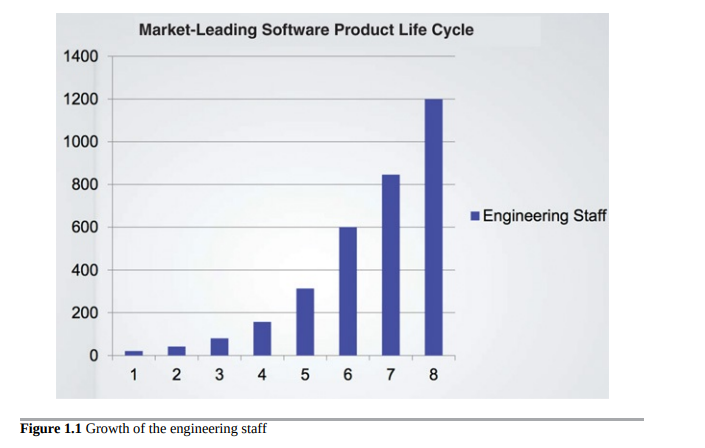
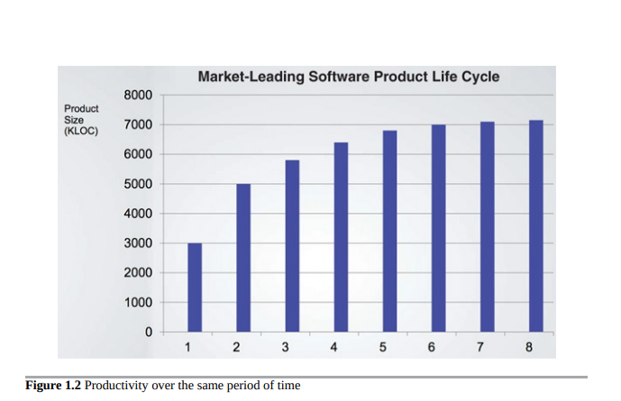
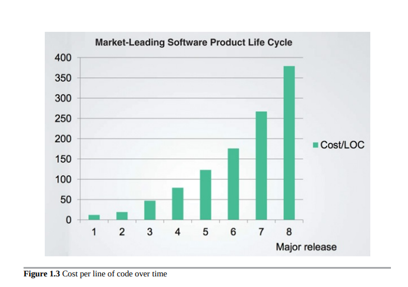
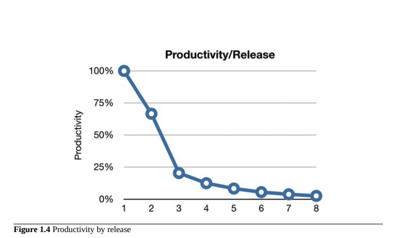
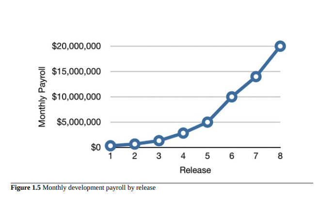
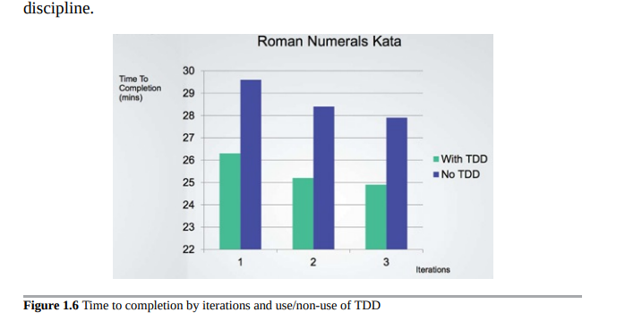

- [案例研究](#案例研究)
  - [混乱代码的标志](#混乱代码的标志)
  - [高管视角](#高管视角)
  - [出了什么问题？](#出了什么问题)

## 案例研究

以下面的案例研究为例。它包括一家希望保持匿名的真实公司的实际数据。

首先，让我们看看工程人员的增长。我相信您会同意这种趋势非常令人鼓舞。像图1.1所示的增长一定是显著成功的表现！

图1.1 工程人员的增长

经杰森·戈尔曼(Jason Gorman)的幻灯片授权制作

现在让我们看看公司在同一时期的生产力，通过简单的代码行来衡量(图1.2)

显然这里出了问题。尽管每个版本都得到了越来越多的开发人员的支持，但代码的增长似乎正在接近渐近线。下面是一个非常可怕的图表:图1.3显示了每行代码的成本是如何随时间变化的。这些趋势是不可持续的。公司目前的盈利能力如何并不重要:这些曲线将灾难性地耗尽商业模式的利润，并使公司陷入停滞，如果不是彻底崩溃的话。是什么导致了生产力的这种显著变化?为什么在第8版中编写代码的成本是第1版的40倍。

### 混乱代码的标志
你所看到的是混乱代码的标志。当系统被匆忙地拼凑在一起，当纯粹的程序员数量是产出的唯一驱动因素，当对代码的清洁度或设计结构几乎没有考虑时，那么你可以确定你将沿着这条曲线走向其丑陋的结局。

图1.4展示了开发人员看到的这条曲线。他们最初的生产率几乎达到了100％，但随着每个发布版本的推出，他们的生产率逐渐下降。到第四个版本，显然
他们的生产率将以渐进逼近零的方式达到最低点。

图1.4 每个发布版本的生产率

从开发人员的角度来看，这非常令人沮丧，因为每个人都在努力工作，没有人减少了他们的努力。然而，尽管他们的英雄主义，加班和奉献，他们现在只能做很少的事情。他们所有的努力都被转移到了处理混乱代码上。他们的工作已经变成了将混乱的代码从这个地方移动到下一个地方，再到下一个地方，以便他们可以添加一个微不足道的小功能。

### 高管视角

如果你认为这已经很糟糕了，那就想象一下对于高管们来说这张图是什么样子吧！

请看图1.5，它展示了同一时期每月的开发人员工资支出情况。

图1.5 按版本发布的每月开发人员工资支出

第一次发布的每月工资支出为几十万美元。第二个版本的成本又增加了几十万美元。到了第八个版本，每月的工资支出已经达到了2000万美元，并且还在上升。

仅仅这张图就足以令人感到惊恐。很明显，某些惊人的事情正在发生。人们希望收入超过成本，从而证明这样的支出是有合理性的。但无论你怎么看这个曲线，都会引起担忧。

但是，现在将图1.5中的曲线与图1.2中的每次发布的代码行数进行比较。最初每月几十万美元的开支购买了很多功能，但最终的2000万美元几乎没买到什么！任何首席财务官都会看到这两个图表，并知道需要立即采取行动来避免灾难。

但是可以采取哪些行动呢？出了什么问题？是什么导致了生产力的惊人下降？高管们能做什么，除了在开发人员面前跺脚大发雷霆？

### 出了什么问题？

将近2600年前，伊索讲了“乌龟和兔子”的寓言故事。这个故事的寓意已经被多次以多种不同的方式表达过了：

- “稳扎稳打，赢得比赛。”
- “速度不是最重要的，实力也不是最关键的。”
- “欲速则不达。”

这个故事本身说明了过度自信的愚蠢。兔子相信自己的速度天赋，没有认真对待比赛，结果在乌龟越过终点线时正在睡觉。

现代开发者也处于类似的比赛中，并表现出相似的自信心。噢，他们没有睡觉——远远不是这样。大多数现代开发者工作得非常努力。但是，他们大脑中的一部分却在睡觉——那部分知道好的、干净的、设计良好的代码很重要。

这些开发者相信一个熟悉的谎言：“我们可以稍后再清理它；我们只是要先上市！”当然，事情从来没有稍后清理过，因为市场压力从未减弱。先上市只意味着你现在有一大群竞争对手在你的后面，你必须尽可能快地跑得比他们快。

所以，开发者从不切换模式。他们不能回去清理东西，因为他们必须完成下一个功能，下一个，下一个，下一个。因此，混乱不断增加，生产力继续朝零的渐近趋势发展。

就像兔子对自己的速度过于自信一样，开发者对自己保持生产力过于自信。但是那些耗费他们生产力的代码混乱从不睡觉，从不松懈。如果让它自己发展，它会在几个月内将生产力降至零。

开发者相信的更大的谎言是，写乱代码可以让他们在短期内快速前进，但在长期内只会减缓他们的速度。接受这个谎言的开发者表现出兔子对他们从制造混乱到在未来的某个时候清理混乱的能力的过度自信，但他们也犯了一个简单的事实错误。事实是，制造混乱总是比保持干净慢，无论你使用哪个时间尺度。

考虑Jason Gorman进行的一项非凡实验的结果，如图1.6所示。Jason在六天的时间里进行了这个测试。每天他完成一个简单的程序，将整数转换为罗马数字。当他的预定义的接受测试通过时，他知道他的工作完成了。每天的任务需要不到30分钟。Jason在第一天、第三天和第五天使用了一种被称为测试驱动开发（TDD）的著名纪律。在其他三天，他没有使用这种纪律编写代码。

首先，注意图1.6中呈现的学习曲线。后面几天的工作比前几天更快完成。还要注意的是，TDD（测试驱动开发）的工作日比非TDD的工作日快约10％，即使最慢的TDD工作日也比最快的非TDD工作日快。

一些人可能会认为这是一个非凡的结果。但对于那些没有被兔子的自负所蒙蔽的人来说，这个结果是可以预料的，因为他们知道软件开发的一个简单真理：唯一快速的方法就是做得好。

这就是执行者的困境的答案。扭转生产力下降和成本增加的唯一方法是让开发人员停止像自负的兔子一样思考，并开始对他们制造的混乱负责。

开发人员可能认为，答案是从头开始重新设计整个系统，但这只是兔子再次说话。导致混乱的自负现在告诉他们，只要他们重新开始比赛，他们就可以构建更好的系统。现实并不那么乐观：他们的自负会把重新设计推向与原始项目一样的混乱状态。
