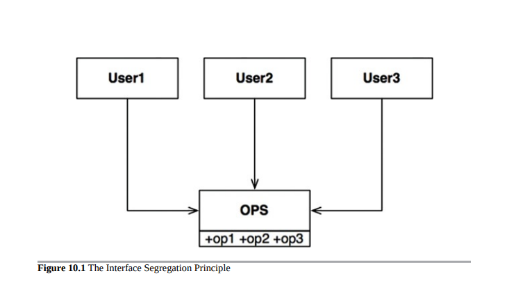

# ISP 接口隔离原则 (Interface Segregation Principle)

接口隔离原则（ISP）得名于图10.1中的图示。

在图10.1所示的情况下，有多个用户使用OPS类的操作。假设User1仅使用op1，User2仅使用op2，而User3仅使用op3。

现在想象一下，OPS是一种像Java这样的语言中编写的类。显然，在这种情况下，User1的源代码将无意中依赖于op2和op3，即使它不调用它们。这种依赖意味着对OPS中op2的源代码的更改将强制重新编译并部署User1，即使它实际关心的内容没有改变。

这个问题可以通过将操作分隔成接口来解决，如图10.2所示。

同样，如果我们想象这是在像Java这样的静态类型语言中实现的，那么User1的源代码将依赖于U1Ops和op1，但不会依赖于OPS。因此，对User1无关的OPS的更改不会导致必须重新编译和重新部署User1。

## ISP和语言

显然，先前给出的描述在很大程度上取决于语言类型。像Java这样的静态类型语言强制程序员创建用户必须导入、使用或包含的声明。正是这些源代码中包含的声明创建了源代码依赖性，从而强制重新编译和重新部署。

在像Ruby和Python这样的动态类型语言中，这些声明在源代码中不存在。相反，它们在运行时推断。因此，没有源代码依赖性可以强制重新编译和重新部署。这是动态类型语言创建的系统比静态类型语言更灵活、耦合度更低的主要原因。

这个事实可能会让你得出结论，ISP是一个语言问题，而不是一个架构问题。

## ISP和架构

如果你退后一步，看一下ISP的根本动机，你就会看到隐藏着更深层次的关注。一般来说，依赖包含超出你所需的内容的模块是有害的。这在源代码依赖方面显然是正确的，因为它可能会强制进行不必要的重新编译和重新部署，但在更高层次的架构中也是如此。

例如，考虑一位正在开发系统S的架构师。他想将某个框架F包含到系统中。现在假设F的作者已将其绑定到特定的数据库D上。因此，S依赖于F，而F又依赖于D（图10.3）。

现在假设D包含F不使用的功能，因此S不关心它们。对D中这些功能的更改可能会强制重新部署F，因此也要重新部署S。更糟糕的是，D中的某个功能出现故障可能会导致F和S的故障。

## 结论

这里的教训是，依赖于一些不必要的负担可能会导致您意想不到的麻烦。

在第13章“组件内聚”中，当我们讨论共同重用原则时，我们将更详细地探讨这个想法。
