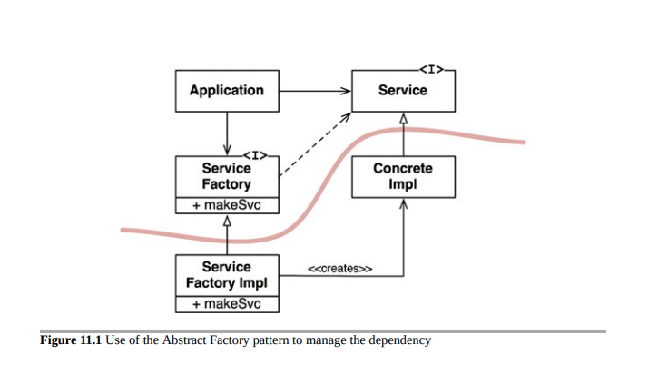

- [DIP 依赖反转原则 (Dependency Inversion Principle)](#dip-依赖反转原则-dependency-inversion-principle)
  - [稳定的抽象](#稳定的抽象)
  - [工厂模式](#工厂模式)
  - [具体组件](#具体组件)

# DIP 依赖反转原则 (Dependency Inversion Principle)

依赖倒置原则（DIP）告诉我们，最灵活的系统是那些源代码依赖仅引用抽象而不是具体实现的系统。

在像Java这样的静态类型语言中，这意味着使用、导入和包含语句应仅引用包含接口、抽象类或某种其他抽象声明的源模块。不应该依赖于具体实现。

对于动态类型语言（如Ruby和Python），同样的规则适用。源代码依赖不应引用具体模块。但是，在这些语言中，有点难以定义什么是具体模块。特别是，任何被调用的函数实现都属于具体模块。

显然，将这个想法视为规则是不现实的，因为软件系统必须依赖许多具体设施。例如，Java中的String类是具体的，试图将其强制变为抽象是不现实的。对具体的java.lang.string的源代码依赖不能被避免，也不应该被避免。

相比之下，String类非常稳定。对该类的更改非常罕见且受到严格控制。程序员和架构师不必担心String的频繁和反复无常的变化。

出于这些原因，当涉及到依赖倒置原则时，我们倾向于忽略操作系统和平台设施的稳定背景。我们容忍那些具体的依赖，因为我们知道我们可以依赖于它们不会改变。

我们想要避免依赖的是我们系统中不稳定的具体元素。那些是我们正在积极开发并且正在经历频繁变化的模块。

## 稳定的抽象

对抽象接口的每次更改都对应着对其具体实现的更改。相反，对具体实现的更改并不总是或甚至通常不需要对它们实现的接口进行更改。因此，接口比实现不易变。

事实上，优秀的软件设计师和架构师努力减少接口的不稳定性。他们尝试找到在不更改接口的情况下添加实现功能的方法。这是软件设计的基础。

因此，稳定的软件架构是那些避免依赖不稳定的具体实现，而更倾向于使用稳定的抽象接口。这个想法归结为一组非常具体的编码实践：

- 不要引用不稳定的具体类。应该引用抽象接口。这个规则适用于所有语言，无论是静态还是动态类型。它还对对象的创建施加了严格的限制，通常强制执行使用抽象工厂。

- 不要从不稳定的具体类中继承。这是前面规则的必然结果，但也需要特别提到。在静态类型语言中，继承是源代码关系中最强和最严格的，因此应该谨慎使用。在动态类型语言中，继承不是很大的问题，但仍然是一种依赖，因此谨慎总是最明智的选择。

- 不要重写具体函数。具体函数通常需要源代码依赖。当你重写这些函数时，你并没有消除这些依赖，相反，你继承了它们。为了管理这些依赖关系，应该将函数定义为抽象的，并创建多个实现。

- 永远不要提到任何具体和不稳定的名称。这实际上只是原则本身的重申。

## 工厂模式

为了遵循这些规则，需要特别处理易变的具体对象的创建。这是有必要的，因为在几乎所有编程语言中，创建对象需要依赖于该对象的具体定义的源代码。

在大多数面向对象语言中，如Java，我们使用抽象工厂来管理这种不良依赖关系。图11.1显示了该结构。应用程序通过Service接口使用ConcreteImpl。

但是，应用程序必须以某种方式创建ConcreteImpl的实例。为了在不创建对ConcreteImpl的源代码依赖的情况下实现这一点，应用程序调用ServiceFactory接口的makeSvc方法。该方法由ServiceFactoryImpl类实现，该类派生自ServiceFactory。该实现实例化ConcreteImpl并将其作为服务返回。

图11.1使用抽象工厂模式管理依赖关系的用法

图11.1中的弯曲线是一个架构边界。它将抽象与具体分开。所有源代码依赖关系都穿过该弯曲线，指向抽象的一侧。弯曲线将系统分为两个组件：一个抽象组件和另一个具体组件。抽象组件包含应用程序的所有高级业务规则。具体组件包含这些业务规则操作的所有实现细节。请注意，控制流穿过弯曲线的方向与源代码依赖关系相反。源代码依赖关系反转了控制流-这就是我们将这个原则称为“依赖反转”的原因。

## 具体组件

图11.1中的具体组件包含一个依赖项，因此它违反了DIP原则。这是很常见的情况。DIP违规不能完全消除，但可以将它们聚集到少数几个具体组件中，并与系统的其余部分分开。
大多数系统都将包含至少一个这样的具体组件 - 通常称为主要组件，因为它包含主函数1。在图11.1所示的情况下，主函数将实例化ServiceFactoryImpl并将该实例放置在类型为ServiceFactory的全局变量中。然后，应用程序将通过该全局变量访问工厂。

##　结论

随着我们在本书中继续介绍更高级别的架构原则，DIP原则将一次又一次地出现。它将成为我们架构图中最明显的组织原则。图11.1中的曲线将成为后面章节中的架构边界。依赖关系在一个方向上越过曲线的方式，以及朝着更抽象的实体的方式，将成为一个新的规则，我们将其称为依赖关系规则。
