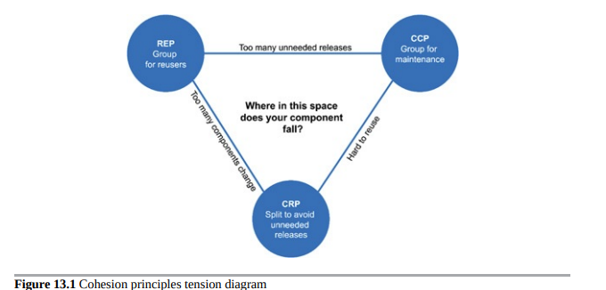

## 组件内聚性的张力图表

你可能已经意识到，这三个内聚性原则往往相互抵触。REP和CCP是包容性原则：两者都倾向于使组件更大。CRP是一个排他性原则，推动组件更小。优秀的架构师寻求解决的是这些原则之间的张力。

图13.1是一个张力图表，显示了内聚性的三个原则如何相互作用。图表的边缘描述了在相反顶点上放弃该原则的代价。

图13.1 内聚性原则张力图表

只关注REP和CRP的架构师会发现，当进行简单的更改时，影响了太多组件。相比之下，过分关注CCP和REP的架构师会导致生成过多不必要的版本发布。

一个好的架构师在张力三角形中找到一个位置，满足开发团队当前的关注点，但也意识到这些关注点会随时间而变化。例如，在项目开发的早期，CCP比REP更重要，因为开发能力比重用性更重要。

通常，项目倾向于从三角形的右侧开始，其中唯一的牺牲是重用。随着项目的成熟，其他项目开始从中汲取经验，项目将向左滑动。这意味着项目的组件结构可能随时间和成熟度而变化。这更多取决于项目的开发和使用方式，而不是项目实际做了什么。