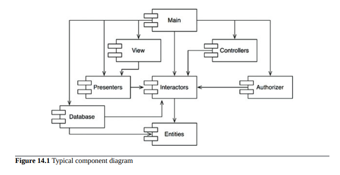
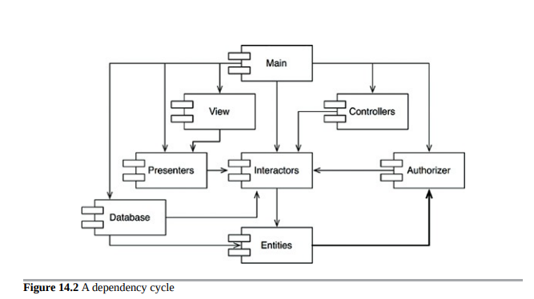
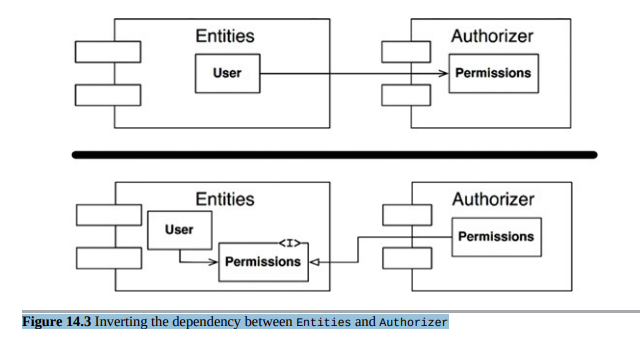
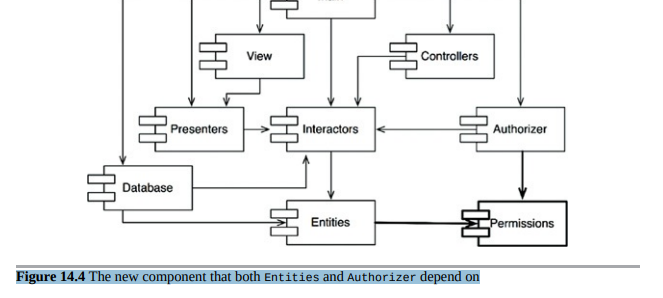

- [非循环依赖原则 ADP(ACYCLIC DEPENDENCIES PRINCIPLE)](#非循环依赖原则-adpacyclic-dependencies-principle)
  - [消除依赖循环](#消除依赖循环)
  - [组件依赖图中的循环效应](#组件依赖图中的循环效应)
  - [打破循环](#打破循环)

## 非循环依赖原则 ADP(ACYCLIC DEPENDENCIES PRINCIPLE)

> 在组件依赖图中没有循环依赖。

你有没有经历过一整天的工作，终于让一些东西运作起来，然后回家，第二天却发现你的东西不再工作了？为什么它不工作了？因为有人比你晚留下来，改变了你所依赖的某些东西！我称之为“第二天早上综合症”。
“第二天早上综合症”发生在许多开发者修改同一源文件的开发环境中。在只有几个开发者的相对较小的项目中，这不是太大的问题。但是随着项目和开发团队的规模增长，第二天早上的情况可能会变得相当可怕。团队有可能经过数周的努力，仍然无法构建一个稳定版本的项目。相反，每个人都在改变他们的代码，试图让它与别人最后一次所做的更改相适应。

在过去的几十年中，两种解决这个问题的解决方案已经出现，这两种方案都来自于电信行业。第一种是“每周构建”，第二种是非循环依赖原则（ADP）。
- [非循环依赖原则 ADP(ACYCLIC DEPENDENCIES PRINCIPLE)](#非循环依赖原则-adpacyclic-dependencies-principle)
  - [消除依赖循环](#消除依赖循环)
  - [组件依赖图中的循环效应](#组件依赖图中的循环效应)
  - [打破循环](#打破循环)

### 消除依赖循环

这个问题的解决方案是将开发环境划分为可发布的组件。这些组件成为可以由单个开发者或团队负责的工作单元。当开发者让一个组件工作时，他们会发布它供其他开发者使用。他们给它一个发布号，并将其移动到其他团队可以使用的目录中。然后他们继续在自己的私人区域修改他们的组件。其他人使用发布的版本。
当组件的新版本可用时，其他团队可以决定是否立即采用新版本。如果他们决定不这样做，他们只需继续使用旧版本。一旦他们决定准备好了，他们就开始使用新版本。
因此，没有团队处于其他团队的掌控之下。对一个组件所做的更改不需要立即影响其他团队。每个团队可以自行决定何时将自己的组件适应组件的新版本。此外，集成以小的增量发生。没有一个时间点需要所有开发者集合起来并集成他们正在做的一切。
这是一个非常简单和合理的过程，被广泛使用。但是，要使其成功运作，您必须管理组件的依赖结构。不能有循环。如果依赖结构中存在循环，则无法避免“第二天早上综合症”。
考虑图14.1中的组件图。它显示了组件组装成应用程序的相当典型的结构。此应用程序的功能对于此示例的目的不重要。重要的是组件的依赖结构。请注意，该结构是一个有向图。组件是节点，依赖关系是有向边。

注意一件事情：无论从哪个组件开始，都不可能按照依赖关系循环回到该组件。这种结构没有循环。它是一个有向无环图（DAG）。现在考虑当负责 Presenters 组件的团队发布其组件的新版本时会发生什么。很容易找出受此发布影响的人员；只需沿着依赖箭头向后追溯即可。因此，View 和 Main 都将受到影响。当前正在这些组件上工作的开发人员将不得不决定何时将其工作与 Presenters 的新版本集成。还要注意，当 Main 发布时，它对系统中的任何其他组件都没有影响。它们不知道 Main，也不关心它何时更改。这很好。这意味着发布 Main 的影响相对较小。当正在 Presenters 组件上工作的开发人员想要运行该组件的测试时，他们只需要将他们正在使用的 Interactors 和 Entities 组件版本与 Presenters 的版本一起构建。系统中的其他组件都不需要参与。这很好。这意味着正在 Presenters 上工作的开发人员相对来说需要做很少的工作来设置测试，并且他们需要考虑相对较少的变量。当是发布整个系统的时间时，该过程从底部向上进行。首先编译、测试和发布 Entities 组件。然后进行 Database 和 Interactors。这些组件之后是 Presenters、View、Controllers，最后是 Authorizer。Main 最后发布。这个过程非常清晰，易于处理。我们知道如何构建该系统，因为我们理解其部分之间的依赖关系。

### 组件依赖图中的循环效应

假设一个新的需求迫使我们改变Entities中的一个类，使其使用Authorizer中的一个类。例如，假设Entities中的User类使用Authorizer中的Permissions类。这将创建一个依赖循环，如图14.2所示。

这个循环会带来一些直接的问题。例如，正在开发Database组件的开发人员知道，要发布该组件，必须与Entities兼容。然而，有了这个循环，Database组件现在还必须与Authorizer兼容。但是，Authorizer又依赖于Interactors。这使得发布Database组件变得更加困难。实际上，Entities、Authorizer和Interactors已经成为一个大组件，这意味着所有在这些组件上工作的开发人员都将经历可怕的“早上综合症”。他们将互相干扰，因为他们必须完全使用彼此组件的相同版本。

但这只是问题的一部分。考虑一下当我们想要测试Entities组件时会发生什么。令人失望的是，我们发现我们必须构建和集成Authorizer和Interactors。这种组件之间的耦合程度令人担忧，甚至无法忍受。

你可能会想为什么你必须包含这么多不同的库，以及其他人的大量代码，只是为了运行一个简单的单元测试。如果你稍微调查一下，你可能会发现依赖图中存在循环。这种循环使得分离组件非常困难。单元测试和发布变得非常困难和容易出错。此外，构建问题随模块数量呈几何级增长。

此外，当依赖图中存在循环时，很难确定构建组件的顺序。实际上，可能没有正确的顺序。这可能导致一些非常恶劣的问题，尤其是在像Java这样从已编译二进制文件中读取其声明的语言中。

### 打破循环

总是有可能打破组件的循环并将依赖图恢复为DAG。有两种主要机制可以做到这一点：

应用依赖反转原则（DIP）。在图14.3的情况下，我们可以创建一个具有用户需要方法的接口。然后将该接口放入实体中，并继承到授权器中。这将反转实体和授权器之间的依赖关系，从而打破循环。
图14.3 反转实体和授权器之间的依赖关系
创建一个新组件，实体和授权器都依赖于它。将它们都依赖的类移动到该新组件中（图14.4）。
图14.4 实体和授权器都依赖的新组件

第二种解决方案意味着组件结构在面对不断变化的需求时是不稳定的。实际上，随着应用程序的增长，组件依赖结构会出现抖动和增长。因此，必须始终监视依赖结构以检测循环。当发生循环时，必须以某种方式打破它们。有时这意味着创建新组件，使依赖结构增长。

