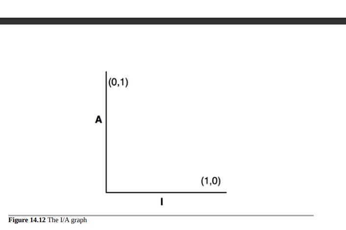
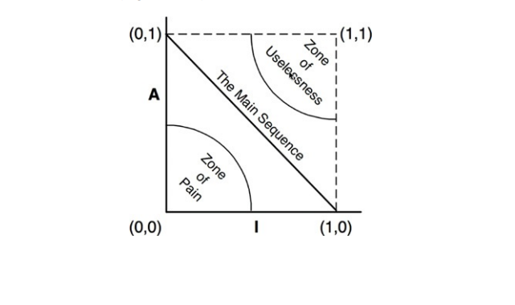
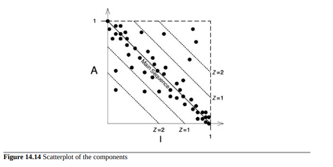
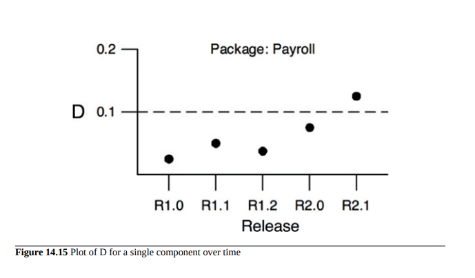

- [稳定抽象原则 SAP(Stable Abstractions Principle)](#稳定抽象原则-sapstable-abstractions-principle)
  - [高层策略应该放在哪里？](#高层策略应该放在哪里)
  - [介绍稳定的抽象原则](#介绍稳定的抽象原则)
  - [衡量抽象程度](#衡量抽象程度)
  - [主序列](#主序列)
  - [痛苦区](#痛苦区)
  - [无用区](#无用区)
  - [避免排除区域](#避免排除区域)
  - [距离主序列的距离](#距离主序列的距离)

## 稳定抽象原则 SAP(Stable Abstractions Principle)

> 一个组件应该尽可能地抽象，同时保持稳定。

### 高层策略应该放在哪里？

系统中有些软件不应该经常更改。这些软件代表了高层架构和策略决策。我们不希望这些业务和架构决策不稳定。因此，封装系统高层策略的软件应该放在稳定的组件中（I = 0）。不稳定的组件（I = 1）应该只包含易变的软件 - 我们希望能够快速轻松地更改的软件。

然而，如果高层策略放在稳定的组件中，则代表这些策略的源代码将难以更改。这可能会使整体架构变得不灵活。一个最大程度稳定（I = 0）的组件如何足够灵活以经受变化？答案在于开闭原则（OCP）。这个原则告诉我们，创建足够灵活以便于扩展而无需修改的类是可能的和理想的。哪种类符合这个原则？抽象类。

### 介绍稳定的抽象原则

稳定的抽象原则（SAP）建立了稳定性和抽象性之间的关系。一方面，它表明稳定的组件也应该是抽象的，以便不会因为其稳定性而无法扩展。另一方面，它表明不稳定的组件应该是具体的，因为其不稳定性允许其中的具体代码轻松更改。

因此，如果组件要稳定，它应该由接口和抽象类组成，以便可以扩展。可扩展的稳定组件是灵活的，不会过度限制架构。

SAP和SDP的结合相当于组件的DIP。这是因为SDP表示依赖关系应该沿着稳定性方向运行，而SAP表示稳定性意味着抽象。因此，依赖关系沿着抽象方向运行。

然而，DIP是处理类的原则 - 在类中没有灰色区域。一个类要么是抽象的，要么不是。SDP和SAP的组合处理组件，允许组件部分是抽象的，部分是稳定的。

### 衡量抽象程度

A度量是衡量组件抽象程度的指标。其值是组件中接口和抽象类的数量与组件中类的总数量的比值。

+ Nc：组件中的类数。
+ Na：组件中抽象类。
+ A：抽象度。A = Na ÷ Nc。

A度量的范围从0到1。值为0表示组件根本没有抽象类。值为1表示组件中只包含抽象类。

### 主序列

我们现在可以定义稳定性（I）和抽象度（A）之间的关系。为此，我们在垂直轴上用A，在水平轴上用I创建一个图表（图14.12）。如果我们将这两种“好”的组件在这个图表上绘制出来，我们会发现最大稳定性和抽象性的组件位于左上角（0，1）。最不稳定和具体化的组件位于右下角（1，0）。

并不是所有的组件都落在这两个位置之一，因为组件通常具有一定的抽象度和稳定性。例如，一个抽象类很常见地从另一个抽象类派生出来。这个派生类是一个具有依赖关系的抽象类。因此，虽然它是最大的抽象类，但它不会是最大的稳定性。它的依赖性会降低其稳定性。

由于我们不能强制要求所有组件坐在（0,1）或（1,0）上，因此我们必须假设在A/I图上有一系列点，它定义了组件合理的位置。我们可以通过确定不应该有组件的区域来推断出那个点的位置，换句话说，通过确定排除区域来确定排除的区域（图11.13）。

###  痛苦区

考虑一个在（0,0）区域的组件。这是一个高度稳定和具体的组件。这样的组件不可取，因为它是刚性的。它无法扩展，因为它不是抽象的，并且由于其稳定性，非常难以更改。因此，我们通常不期望看到设计良好的组件坐在（0,0）附近。围绕（0,0）的区域是一个被称为痛苦区的排除区域。

实际上，确实有一些软件实体位于痛苦区。一个例子是数据库模式。数据库模式非常不稳定，极为具体，且高度依赖。这就是为什么面向对象应用程序和数据库之间的接口很难管理，而模式更新通常很痛苦的原因之一。

位于（0,0）区域附近的另一个软件示例是具体实用程序库。虽然这样的库的I指标为1，但实际上可能是不稳定的。例如，考虑字符串组件。即使其中所有类都是具体的，但它被如此广泛地使用，以至于更改它会造成混乱。因此，字符串是不稳定的。

在（0,0）区域内，非稳定组件是有问题的，而非稳定组件是无害的，因为它们不太可能发生更改。因此，在痛苦区中只有挥发性软件组件是有问题的。在痛苦区中，组件越挥发性，就越“痛苦”。事实上，我们可以将挥发性视为图的第三个轴。有了这个理解，图14.13仅显示了最痛苦的平面，其中挥发性=1。

### 无用区

考虑一个位于（1,1）附近的组件。这个位置是不可取的，因为它是最大抽象，但没有任何依赖关系。这种组件是无用的。因此，该区域被称为无用区域。

位于这个区域的软件实体是一种残留物。它们通常是没有任何人实现的抽象类。我们不时地在系统中找到它们，它们闲置在代码库中。

位于无用区域深处的组件必须包含相当比例的这种实体。显然，这些无用实体的存在是不可取的。

### 避免排除区域

很明显，我们最不稳定的组件应尽可能远离两个排除区域。距离每个区域最远的点的轨迹是连接（1，0）和（0，1）的线。我把这条线称为主序列。

在主序列上的组件既不“太抽象”以至于不稳定，也不“太不稳定”以至于抽象。它既不无用，也不特别痛苦。它的抽象程度取决于它的依赖程度，它的具体程度取决于其他组件的依赖程度。

对于组件来说，最理想的位置是在主序列的两个端点之一。好的架构师努力将大部分组件放置在这些端点上。然而，根据我的经验，在大型系统中，只有一小部分组件既不完全抽象也不完全稳定。如果这些组件处于或接近主序列上，则它们具有最佳特性。

### 距离主序列的距离

这导致我们提出了最后一个度量标准。如果希望组件处于主序列上或接近主序列，则可以创建一个度量标准，用于测量组件离理想位置的距离。

+ 距离 D = |A+I–1|。此度量标准的范围为[0, 1]。值为0表示该组件直接位于主序列上。值为1表示该组件与主序列的距离最远。

根据这个度量标准，可以分析设计是否符合主序列。可以计算每个组件的 D 度量标准。任何 D 值不接近零的组件都可以重新审查和重组。

设计的统计分析也是可能的。我们可以计算设计内所有组件的 D 度量标准的平均值和方差。我们期望符合要求的设计具有接近零的平均值和方差。方差可以用来建立“控制限”，以识别与其他组件“异常”的组件。

在图 14.14 的散点图中，我们看到大部分组件位于主序列上，但有些组件距离平均值超过一个标准偏差（Z = 1）。这些异常组件值得仔细检查。出于某种原因，它们要么非常抽象且依赖较少，要么非常具体且依赖较多。

使用这些度量标准的另一种方法是绘制每个组件的 D 度量标准随时间的变化图。图 14.15 是这样一个图的样本。可以看到，一些奇怪的依赖关系在最近几个版本中逐渐出现在薪资组件中。该图显示了 D = 0.1 的控制阈值。R2.1 点已超过此控制限，因此我们值得去了解为什么这个组件与主序列相距如此遥远。

