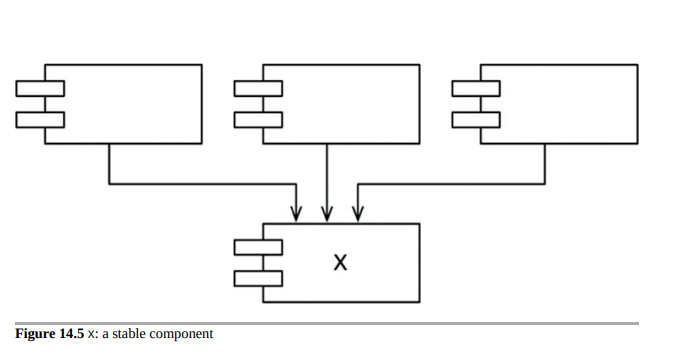
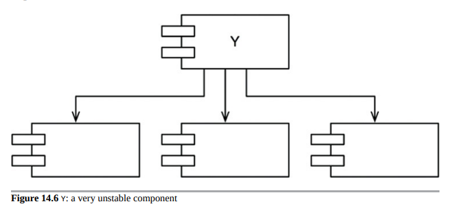
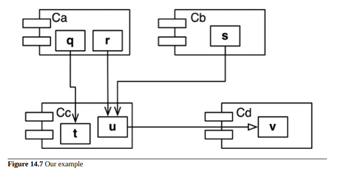
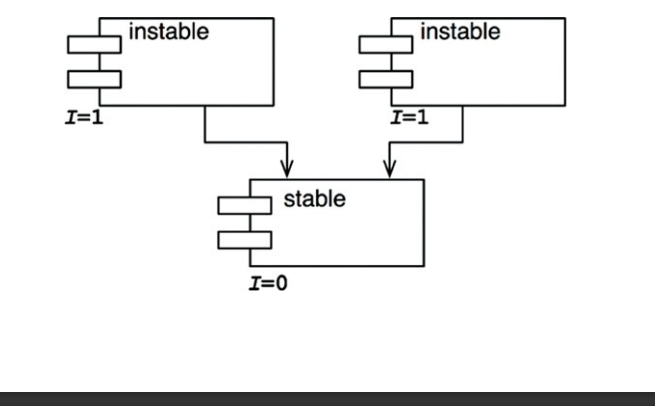
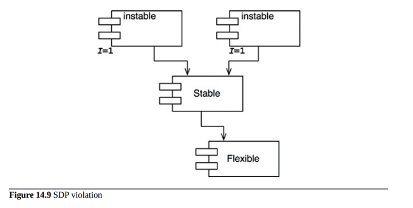
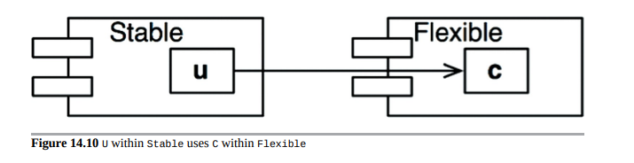
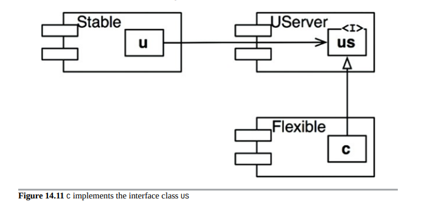

## 稳定依赖原则 SDP(STABLE DEPENDENCIES PRINCIPLE)

向稳定方向进行依赖。
设计不可能完全静态，如果设计需要维护，那么一定会存在一些不稳定因素。通过遵守共同封闭原则（CCP），我们可以创建对某些变化敏感但免疫于其他变化的组件。其中一些组件被设计成易变的，我们期望它们会改变。

我们认为易变的任何组件都不应该被难以更改的组件所依赖。否则，易变组件也会变得难以改变。

有些软件的恶劣之处在于，一个被设计为易于改变的模块，可能会被其他人通过依赖关系变得难以改变。你的模块没有改变任何一行源代码，但是你的模块突然变得更难以改变。通过遵循稳定依赖原则（SDP），我们确保旨在易于改变的模块不会被更难改变的模块所依赖。

### 稳定性

什么是“稳定性”？ 把一枚硬币立起来。它是稳定的吗？你可能会说“不是”。但是，如果没有干扰，它会保持在那个位置很长时间。因此，稳定性与更改的频率无直接关系。硬币没有变化，但很难把它看作是稳定的。

Webster's词典说，如果某物“不容易移动”，那么它是稳定的。稳定性与进行更改所需的工作量有关。一方面，直立的硬币不稳定，因为将其推倒所需的工作量很小。另一方面，桌子非常稳定，因为将其翻转需要相当大的努力。

这与软件有何关系？许多因素可能使软件组件难以更改，例如其大小、复杂性和清晰度等特性。在这里，我们将忽略所有这些因素，专注于不同的问题。让许多其他软件组件依赖于一个组件是使软件组件难以更改的一种确定的方式。具有许多入依赖的组件非常稳定，因为需要大量工作才能使所有依赖组件与任何更改协调一致。

图14.5中的图表展示了一个稳定的组件X。有三个组件依赖于X，因此它有三个很好的理由不去改变。我们说X对这三个组件负责。相反地，X不依赖任何东西，因此没有外部影响可以使其改变。我们称其为独立的。

图14.6展示了Y，这是一个非常不稳定的组件。其他组件不依赖于Y，因此我们说它是不负责任的。Y也有三个它依赖的组件，因此可能来自三个外部来源的更改。我们说Y是有依赖性的。

###　稳定性指标

我们如何衡量组件的稳定性？一种方法是计算进入和离开该组件的依赖关系数量。这些计数将允许我们计算组件的位置稳定性。

+ Fan-in：传入的依赖关系。该指标标识了该组件外部的类依赖于组件内的类的数量。
+ Fan-out：传出的依赖关系。该指标标识依赖于组件外部类的组件内部类的数量。
+ I：不稳定度：I = Fan-out /（Fan-in + Fan-out）。此度量的范围为[0，1]。I = 0表示最稳定的组件。I = 1表示最不稳定的组件。

Fan-in和Fan-out指标1是通过计算与问题组件内部类存在依赖关系的问题组件之外的类的数量来计算的。请考虑图14.7中的示例。

让我们假设我们要计算组件Cc的稳定性。我们发现有三个Cc之外的类依赖于Cc中的类。因此，Fan-in = 3。此外，有一个类在Cc之外，依赖于Cc中的类。因此，Fan-out = 1且I = 1/4。

在C++中，这些依赖关系通常由#include语句表示。事实上，当您组织源代码以每个源文件一个类时，I指标最容易计算。在Java中，可以通过计算import语句和限定名称来计算I指标。

当I度量等于1时，这意味着没有其他组件依赖于该组件（Fan-in = 0），并且该组件依赖于其他组件（Fan-out> 0）。这种情况与组件一样不稳定，它是不负责任且有依赖性的。它的缺乏依赖项使得组件没有理由不改变，并且它所依赖的组件可能会给它充分的理由改变。

相比之下，当I指标等于0时，意味着该组件被其他组件所依赖（Fan-in > 0），但是它本身不依赖于任何其他组件（Fan-out = 0）。这样的组件是负责且独立的，它非常稳定。它的依赖者使得该组件难以改变，而它本身没有任何可能强制其改变的依赖关系。软件设计原则（SDP）指出，一个组件的I指标应该大于它所依赖的组件的I指标。也就是说，I指标应该在依赖方向上递减。

### 并非所有的组件都应该是稳定的

如果系统中的所有组件都是最稳定的，那么该系统将是不可改变的，这并不是一种理想的情况。事实上，我们希望设计我们的组件结构，使得一些组件是不稳定的，而另一些组件是稳定的。图14.8显示了一个具有三个组件的系统的理想配置，可变的组件位于顶部，并依赖于底部的稳定组件。将不稳定的组件放在图表的顶部是一种有用的惯例，因为任何指向上方的箭头都违反了SDP（以及我们稍后将看到的ADP）。

图14.9显示了如何违反SDP。Flexible是一个我们设计成易于更改的组件。我们希望Flexible是不稳定的。然而，某个开发者在名为Stable的组件中工作时，却将依赖关系放在了Flexible上。这违反了SDP，因为Stable的I指标远小于Flexible的I指标。结果，Flexible不再容易更改。更改Flexible将迫使我们处理Stable和它的所有依赖关系。

为了解决这个问题，我们必须想办法打破稳定组件 Stable 对易变组件 Flexible 的依赖关系。为什么会存在这种依赖关系呢？假设 Flexible 中有一个类 C，稳定组件 Stable 中的另一个类 U 需要使用它（见图14.10）。

图14.10 稳定组件 Stable 中的 U 使用易变组件 Flexible 中的 C

我们可以通过采用依赖反转原则（DIP）来解决这个问题。我们创建一个名为 US 的接口类，并将其放置在名为 UServer 的组件中。我们确保该接口声明了 U 需要使用的所有方法。然后，我们将 C 实现这个接口，如图14.11所示。这打破了稳定组件 Stable 对易变组件 Flexible 的依赖关系，强制两个组件都依赖于 UServer。UServer 非常稳定（I = 0），而 Flexible 保留了其必要的不稳定性（I = 1）。现在所有依赖关系都朝着减小 I 的方向流动。

图14.11 C 实现了接口类 US

### 抽象组件

你可能会觉得奇怪，我们会创建一个只包含接口的组件，比如这个例子中的UService。这样的组件没有可执行代码！但事实证明，当使用像Java和C#这样的静态类型语言时，这是一种非常常见且必要的策略。这些抽象组件非常稳定，因此是不稳定组件依赖的理想目标。

在使用像Ruby和Python这样的动态类型语言时，这些抽象组件根本不存在，也不存在针对它们的依赖关系。这些语言中的依赖结构要简单得多，因为依赖反转不需要声明接口或继承接口。