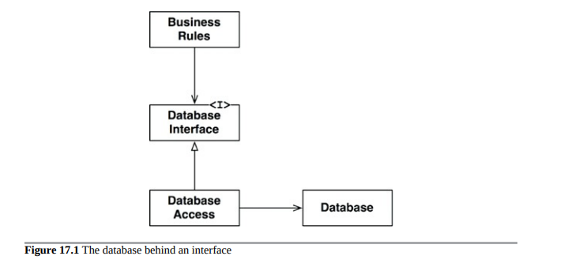

# 边界：画线

软件架构是一门绘制所谓边界的艺术。这些边界将软件元素彼此分离，并限制一侧的元素了解另一侧的元素。其中一些边界在项目的生命周期的非常早期就被划定下来，甚至在编写任何代码之前。其他边界则要晚得多。早期划定这些边界是为了尽可能地推迟决策，并防止这些决策污染核心业务逻辑。

记住，架构师的目标是最小化构建和维护所需系统的人力资源。是什么耗费了这种人力资源？是耦合，尤其是与过早决策的耦合。

哪些决策是过早的？与系统的业务需求 - 用例 - 无关的决策。这些包括关于框架、数据库、Web 服务器、实用程序库、依赖注入等的决策。良好的系统架构是那些决策被附属并可推迟的架构。良好的系统架构不依赖于这些决策。良好的系统架构允许在最后可能的时刻做出这些决策，而不会产生重大影响。

## 几个悲惨的故事

公司P的故事是一个例子。20世纪80年代，P的创始人编写了一个简单的单体桌面应用程序。他们取得了很大的成功，并通过20世纪90年代将产品发展成为一款流行和成功的桌面GUI应用程序。但是，到了20世纪90年代末，Web作为一种力量出现了。突然之间，每个人都必须拥有一个Web解决方案，P也不例外。P的客户要求在Web上推出该产品的版本。为了满足这一需求，该公司雇用了一批年轻有为的二十多岁的Java程序员，并开始了一个将其产品Web化的项目。Java的程序员们梦想着服务器农场，因此他们采用了一个丰富的三层“架构”，可以通过这些农场进行分发。将有用于GUI的服务器、用于中间件的服务器和用于数据库的服务器。当然。

程序员们早早决定所有域对象都会有三个实例：一个在GUI层，一个在中间件层，一个在数据库层。由于这些实例存在于不同的机器上，因此设置了丰富的处理器和层间通信系统。层间方法调用被转换为对象、序列化并跨网络进行编组和解组。

现在想象一下实现一个简单功能（如向现有记录添加新字段）所需的工作量。该字段必须添加到三个层的类中，并且添加到几个层间消息中。由于数据在双向传输，因此需要设计四个消息协议。每个协议都有发送和接收方，因此需要八个协议处理程序。需要构建三个可执行文件，每个文件都有三个更新的业务对象、四个新消息和八个新处理程序。

想象一下这些可执行文件实现最简单的功能所需做的工作。想想所有的对象实例化、所有的序列化、所有的编组和解组、所有消息的构建和解析、所有的套接字通信、超时管理器、重试方案以及所有其他额外的工作，这些都是为了完成一个简单的任务。

当然，在开发过程中，程序员没有服务器农场。实际上，他们只在单台机器上的三个不同进程中运行了所有三个可执行文件。他们以这种方式开发了几年。但他们确信他们的架构是正确的。因此，即使在单台机器上执行，他们仍然在单台机器上继续所有对象实例化、所有序列化、所有编组和解组、所有消息的构建和解析、所有套接字通信和所有其他额外工作。

讽刺的是，P公司从未销售过需要服务器农场的系统。他们部署的每个系统都是单个服务器。在那个单个服务器中，所有三个可执行文件都在继续所有对象实例化、所有序列化、所有编组和解组、所有消息的构建和解析、所有套接字通信和所有额外的工作，期望存在但从未存在、也永远不会存在的服务器农场。

悲剧是，通过做出过早的决定，架构师们大大增加了开发工作量。

P公司的故事并非孤例。我在许多地方看到过这种情况。实际上，P公司是所有这些地方的叠加。
但是，还有比P公司更糟糕的命运。

考虑一家名为W的本地企业，他们管理着一些公司车队。最近，他们聘请了一位“**架构师**”来控制他们混乱的软件工作。让我告诉你，控制是这个人的中间名。他很快意识到这个小操作需要一个完整的、企业规模的、面向服务的“架构”。他创建了一个巨大的领域模型，包括业务中所有不同的“对象”，设计了一套服务来管理这些领域对象，并将所有开发人员引向了地狱之路。以一个简单的例子来说，假设你想将联系人的姓名、地址和电话号码添加到销售记录中。你必须去ServiceRegistry并要求ContactService的服务ID。然后，你必须向ContactService发送一个CreateContact消息。当然，这个消息有几十个字段，所有这些字段都必须包含有效的数据——这些数据程序员是没有访问权限的，因为程序员只有一个姓名、地址和电话号码。伪造了数据之后，程序员必须将新创建的联系人的ID插入销售记录中，并向SaleRecordService发送UpdateContact消息。当然，要测试任何东西，你必须一个接一个地启动所有必要的服务，启动消息总线、BPel服务器等等。然后，这些消息在服务之间反弹，等待在队列中传播延迟。

然后，如果你想添加一个新功能——你可以想象所有这些服务之间的耦合程度，需要改变的大量WSDL，以及这些变化所必需的所有重新部署……相比之下，地狱开始变得像一个美好的地方。

围绕服务构建软件系统本身并没有什么本质上的问题。W的错误在于过早地采用和执行了一套工具，承诺提供SoA——也就是过早地采用了大规模的领域对象服务。这些错误的代价是纯粹的人力——成群的人力——被注入到了SoA漩涡中。

我可以继续描述一个又一个架构失败的例子。但是让我们谈论一个架构成功的例子。

## FITNESSE

我和我的儿子Micah在2001年开始开发FitNesse。这个想法是创建一个简单的Wiki，包装Ward Cunningham的FIT工具以编写验收测试。当时还没有Maven解决JAR文件问题。我坚持认为我们生产的任何东西都不应该要求人们下载超过一个JAR文件。我称这个规则为“下载和运行”。这个规则驱动了我们很多的决策。

第一个决策之一是编写我们自己的Web服务器，特定于FitNesse的需要。这听起来可能有些荒谬。即使在2001年，我们也有很多开源Web服务器可以使用。然而，编写我们自己的Web服务器结果是一个非常好的决策，

接下来，我们开始实现持久化的功能。我们考虑过使用MySQL，但决定暂时不使用它，因为将哈希表写出到平面文件非常容易。所以我们实现了FileSystemWikiPage，它只是将功能移到平面文件中，然后我们继续开发更多功能。

三个月后，我们得出结论：平面文件解决方案已经足够好了。我们决定放弃使用MySQL的想法。我们将这个决定拖延到不存在，也从未再回头看。

如果不是因为有一个客户想要将Wiki放入MySQL，这个故事就结束了。我们向他展示了WikiPages的架构，这使我们能够推迟决策。他一天后回来，整个系统在MySQL中工作了。他只是编写了一个MySqlWikiPage的派生类并让它工作。

我们曾经将该选项与FitNesse捆绑在一起，但其他人从未使用过，所以最终我们放弃了它。甚至编写该派生类的客户最终也放弃了它。

在FitNesse的开发早期，我们在业务规则和数据库之间划定了一条边界线。这条线阻止了业务规则了解数据库之外的任何东西，除了简单的数据访问方法。这个决策让我们能够推迟选择和实现数据库的时间长达一年以上。它使我们能够尝试文件系统选项，当我们看到更好的解决方案时，它也使我们能够改变方向。然而，当有人想要MySQL时，它并没有阻止或甚至妨碍我们按照最初的方向前进。

我们在开发的前18个月没有运行数据库，这意味着在这18个月中，我们没有模式问题、查询问题、数据库服务器问题、密码问题、连接时间问题以及其他一切令人头痛的问题。它还意味着我们所有的测试都很快，因为没有数据库会拖慢它们。

总之，划定边界线帮助我们推迟和延迟决策，最终为我们节省了大量的时间和头痛。这就是良好架构应该做的事情。

## 你会在哪些地方划线，什么时候划线？

你会在重要和不重要的事物之间划线。GUI与业务规则无关，因此它们之间应该有一条线。数据库与GUI无关，因此它们之间应该有一条线。数据库与业务规则无关，因此它们之间应该有一条线。

你们中的一些人可能会拒绝其中一个或多个陈述，特别是关于业务规则不关心数据库的部分。我们中的许多人被教导相信，数据库与业务规则密不可分。我们中的一些人甚至被说服了，认为数据库是业务规则的体现。

但是，正如我们将在另一章节中看到的那样，这个想法是误导人的。数据库是业务规则间接使用的工具。业务规则不需要了解架构、查询语言或数据库的任何其他详细信息。所有业务规则需要知道的是有一组函数可以用来提取或保存数据。这使我们能够将数据库放在接口后面。

你可以清楚地在图17.1中看到这一点。BusinessRules使用DatabaseInterface来加载和保存数据。DatabaseAccess实现接口并指导实际Database的操作。

该图中的类和接口是象征性的。在实际应用中，会有许多业务规则类、许多数据库接口类和许多数据库访问实现。不过，它们都会遵循大致相同的模式。

界限在哪里？该界限横跨继承关系，就在DatabaseInterface的下方（图17.2）。

请注意离开DatabaseAccess类的两个箭头。这两个箭头指向DatabaseAccess类。这意味着这些类中没有一个知道DatabaseAccess类的存在。
现在让我们拉回一点。我们将查看包含许多业务规则的组件和包含数据库及其所有访问类的组件（图17.3）。

请注意箭头的方向。Database知道BusinessRules，而BusinessRules不知道Database。这意味着DatabaseInterface类位于BusinessRules组件中，而DatabaseAccess类位于Database组件中。

## 输入和输出是怎样的？

开发人员和客户常常会混淆系统是什么。他们看到GUI，认为GUI就是系统。他们以GUI为基础来定义系统，因此认为他们应该立即看到GUI开始工作。他们没有意识到一个至关重要的原则：IO（输入/输出）是无关紧要的。一开始可能很难理解。我们经常以IO的行为来思考系统的行为。例如，考虑一个视频游戏。您的体验主要由界面组成：屏幕、鼠标、按钮和声音。您忘记了在界面背后有一个模型——一个复杂的数据结构和功能集——在驱动它。更重要的是，这个模型不需要界面。它会愉快地执行它的任务，模拟游戏中的所有事件，而不需要游戏在屏幕上显示。界面对于模型——业务规则并不重要。因此，我们再次看到GUI和BusinessRules组件被一个边界线分开（图17.4）。再次看到，不那么相关的组件依赖于更相关的组件。箭头显示哪个组件知道另一个组件，因此哪个组件关心另一个组件。GUI关心BusinessRules。

画出这个边界和箭头之后，我们现在可以看到GUI可以用任何其他类型的界面来替换，而BusinessRules并不关心。

## 插件架构

综合考虑到这两个关于数据库和GUI的决策，创造了一种模式，用于添加其他组件。这种模式是允许第三方插件的系统所使用的相同模式。事实上，软件开发技术的历史就是如何方便地创建插件以建立可扩展和可维护的系统架构的故事（图17.5）。核心业务规则与那些可选或可以用许多不同形式实现的组件保持分离和独立。

由于在这个设计中，用户界面被视为插件，因此我们已经使得插入许多不同种类的用户界面成为可能。它们可以是基于Web、客户端/服务器、SOA、控制台或任何其他类型的用户界面技术。

数据库也是如此。由于我们选择将其视为插件，因此我们可以用各种SQL数据库、NOSQL数据库、基于文件系统的数据库或任何我们未来认为必要的其他数据库技术来替换它。

这些替换可能不是微不足道的。如果我们系统的初始部署是基于Web的，那么为客户端/服务器UI编写插件可能具有挑战性。可能需要重新设计业务规则和新UI之间的某些通信。即便如此，通过从插件结构的前提开始，我们至少已经使这样的改变成为实际。

## 插件的作用

考虑一下ReSharper和Visual Studio之间的关系。这些组件由完全不同的开发团队在完全不同的公司中开发。事实上，ReSharper的制造商JetBrains位于俄罗斯，而微软则位于华盛顿州雷德蒙德。很难想象有哪两个开发团队是更分离的。

哪个团队能损害另一个团队？哪个团队对另一个团队免疫？依赖结构讲述了故事（图17.6）。ReSharper的源代码依赖于Visual Studio的源代码。因此，ReSharper团队无法做任何事情来干扰Visual Studio团队。但是，如果愿意，Visual Studio团队完全可以完全禁用ReSharper团队。

这是一种非常不对称的关系，也是我们希望在自己的系统中拥有的关系。我们希望某些模块免疫于其他模块。例如，我们不希望当某人更改网页格式或更改数据库模式时，业务规则会出现故障。我们不希望系统的一部分的变化会导致其他不相关的部分出现故障。我们不希望我们的系统表现出这种脆弱性。

将我们的系统安排成插件架构会在变化不能传播的防火墙之间创建边界。如果GUI插入到业务规则中，则GUI中的更改不能影响这些业务规则。

当有变化轴时，边界就被划定了。边界一侧的组件以不同的速率和出于不同的原因进行更改，而另一侧的组件则不同。

GUI的更改时间和速率与业务规则不同，因此它们之间应该有一个边界。业务规则的更改时间和原因与依赖注入框架不同，因此它们之间应该有一个边界。

这只是单一职责原则再次发挥作用。SRP告诉我们应该在哪里划定边界。

## 结论

为了在软件架构中划定边界，首先需要将系统划分为组件。其中一些组件是核心业务规则，其他组件是包含与核心业务直接无关但必要功能的插件。然后，将这些组件中的代码排列，使它们之间的箭头指向一个方向——指向核心业务。

您应该将其视为依赖反转原则和稳定抽象原则的应用。依赖箭头被排列成从较低级别的细节指向较高级别的抽象。

1. 这里用引号括起来的“架构”一词，是因为三层结构不是一种架构，而是一种拓扑结构。这正是一个好架构努力推迟的决定。
2. 多年后，我们能够将Velocity框架插入到FitNesse中。