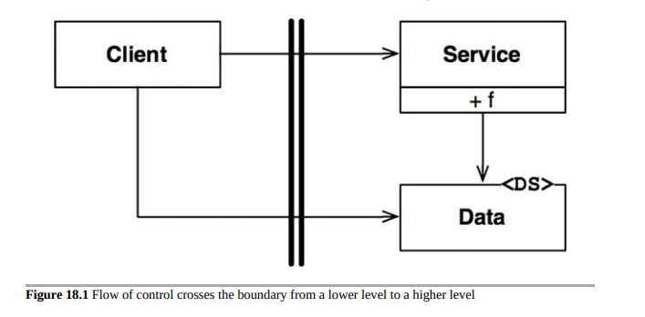
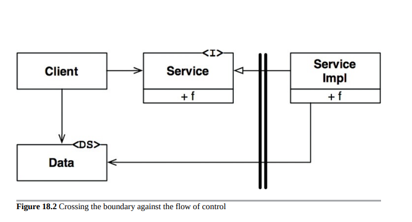

# 边界解剖学

一个系统的架构由一组软件组件和将它们分开的边界定义。这些边界有很多不同的形式。在本章中，我们将看一些最常见的形式。
## 边界交叉
在运行时，边界交叉仅仅是在边界的一侧调用一个函数，将一些数据传递给另一侧的函数。创建一个适当的边界交叉的技巧是管理源代码的依赖关系。

为什么是源代码呢？因为当一个源代码模块发生变化时，其他源代码模块可能需要被修改或重新编译，然后再部署。管理和构建防火墙来防止这种变化就是边界的目的所在。

## 可怕的单块架构

最简单和最常见的架构边界没有严格的物理表示。它仅仅是在单个处理器和单个地址空间内对函数和数据进行纪律性的分离。在之前的一章中，我将其称为源代码级解耦模式。

从部署的角度来看，这只是一个可执行文件——所谓的单块文件。这个文件可能是一个静态链接的C或C++项目，一组Java类文件绑定到一起成为可执行的jar文件，一组.NET二进制文件绑定到一个单独的.EXE文件中等等。

即使在单块架构部署时，边界不可见并且没有意义。即使被静态链接到单个可执行文件中，独立开发和组装各个组件的能力仍然非常有价值。
这种架构几乎总是依赖于某种形式的动态多态性来管理其内部依赖关系。这就是面向对象开发在最近几十年中成为如此重要的范例的原因之一。没有面向对象或等效的多态性形式，架构师必须借助使用函数指针来实现适当的解耦，这是一种危险的做法。大多数架构师认为，使用函数指针过于冒险，因此被迫放弃任何组件分区的形式。

最简单的边界交叉是从低级别客户端到高级别服务的函数调用。运行时依赖性和编译时依赖性都指向同一个方向，向高级别组件。在图18.1中，控制流从左到右穿过边界。客户端调用服务上的函数f()。它传递了一个Data实例。<DS>标记仅表示数据结构。数据可以作为函数参数传递或通过其他更复杂的方式传递。请注意，Data的定义在被调用的边界一侧。

当高层客户端需要调用较低层级服务时，使用动态多态性来反转依赖关系，逆着控制流进行。运行时依赖项与编译时依赖项相对立。

在图18.2中，控制流与之前一样从左到右穿越边界。高层级客户端通过Service接口调用较低级别ServiceImpl的f()函数。注意，所有依赖关系都从右到左穿越边界，指向较高级别组件。还要注意，数据结构的定义在调用方的边界上。

即使在一个静态链接的单体执行文件中，这种有纪律的分区方式也可以极大地帮助开发、测试和部署项目。团队可以独立地在自己的组件上工作，而不会互相干扰。高级组件保持独立于低级细节。

单体架构中组件之间的通信非常快速和廉价。它们通常只是函数调用。因此，跨源级解耦边界的通信可能会非常冗长。由于单体系统的部署通常需要编译和静态链接，因此这些系统中的组件通常以源代码形式交付。

## 部署组件

架构边界最简单的物理表示是动态链接库，例如.Net DLL、Java jar文件、Ruby Gem或UNIX共享库。部署不涉及编译。相反，组件以二进制或某些等效的可部署形式交付。这是部署级别的解耦模式。部署的行为只是将这些可部署单元收集在一起，以某种方便的形式，例如WAR文件，甚至只是一个目录。

除此之外，部署级别的组件与单体应用程序相同。这些函数通常都存在于同一个处理器和地址空间中。隔离组件和管理它们的依赖关系的策略是相同的。

与单体应用程序一样，跨部署组件边界的通信只是函数调用，因此非常廉价。可能存在动态链接或运行时加载的一次性开销，但是这些边界之间的通信仍然可能非常繁琐。

## 线程

单体应用和部署组件都可以使用线程。线程不是架构边界或部署单元，而是一种组织调度和执行顺序的方式。它们可以完全包含在组件内部，也可以分布在许多组件之间。

## 本地进程

本地进程是更强大的物理架构边界。本地进程通常是通过命令行或等效的系统调用创建的。本地进程在同一处理器或在多核处理器的同一组处理器中运行，但在独立的地址空间中运行。内存保护通常防止这些进程共享内存，尽管经常使用共享内存分区。

通常，本地进程之间使用套接字或某些操作系统通信设施（例如邮箱或消息队列）进行通信。每个本地进程可以是静态链接的单体，也可以由动态链接的部署组件组成。在前一种情况下，几个单体进程可能具有相同的组件已编译和链接到其中。在后一种情况下，它们可以共享相同的动态链接的部署组件。

将本地进程视为一种超级组件：进程由管理其依赖关系的较低级组件组成，这些组件通过动态多态性来管理它们的依赖关系。本地进程之间的隔离策略与单体和二进制组件相同。源代码依赖关系指向跨边界的相同方向，并始终指向较高级组件。

对于本地进程，这意味着较高级进程的源代码不得包含较低级进程的名称、物理地址或注册表查找键。请记住，架构目标是将较低级进程作为较高级进程的插件。

跨本地进程边界的通信涉及操作系统调用、数据编码和解码以及进程上下文切换，这是相当昂贵的。应仔细限制交流次数。

## SERVICES

最强的边界是服务（service）。服务是一个进程，通常从命令行或通过等效的系统调用启动。服务不依赖于它们的物理位置。两个通信的服务可以在同一个物理处理器或多核处理器中运行，也可能不在。服务假定所有通信都在网络上进行。

与函数调用相比，服务之间的通信非常缓慢。响应时间可能从几十毫秒到几秒钟不等。必须小心避免过度聊天。在这个层面上的通信必须处理高延迟。

否则，服务的规则与适用于本地进程的规则相同。低级服务应该“插入”到高级服务中。高级服务的源代码不应包含任何关于任何低级服务的具体物理信息（例如，URI）。

## 结论

除了单块系统外，大多数系统都使用了多个边界策略。使用服务边界的系统可能也有一些本地进程边界。实际上，服务通常只是一组交互的本地进程的外观。服务或本地进程几乎肯定是由源代码组件组成的单块，或者是一组动态链接的部署组件。
这意味着系统中的边界通常是本地聊天边界和更关注延迟的边界的混合。

1. 静态多态（例如泛型或模板）有时可以是单块系统中依赖管理的可行手段，特别是在像C++这样的语言中。但是，由于泛型提供的解耦并不能像动态多态那样保护您免受重新编译和部署的需要。
2. 在这种情况下，虽然静态多态不是一种选择
