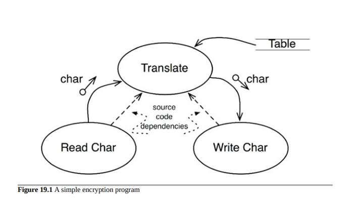
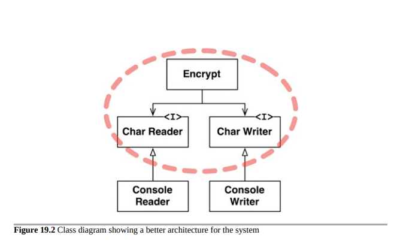

# 政策和级别

软件系统是政策的陈述。实际上，在其核心，这就是计算机程序的全部内容。计算机程序是一份详细说明，说明输入如何转化为输出的政策。
在大多数非平凡的系统中，该政策可以分解为许多不同的小政策陈述。其中一些说明如何计算特定的业务规则。其他的描述了如何格式化某些报告。还有一些描述了如何验证输入数据。

开发软件架构的艺术之一是仔细地将这些政策彼此分离，并根据它们的变化方式进行重新组合。出于相同原因和时间更改的政策处于相同级别，并应在同一组件中。出于不同原因或不同时更改的政策处于不同级别，应分成不同的组件。

架构的艺术经常涉及将重新组合的组件形成有向无环图。图的节点是包含相同级别政策的组件。有向边是这些组件之间的依赖关系。它们连接处于不同级别的组件。

这些依赖是源代码、编译时的依赖关系。在Java中，它们是import语句。在C＃中，它们是using语句。在Ruby中，它们是require语句。它们是编译器正常工作所必需的依赖项。

在一个好的架构中，这些依赖关系的方向是基于它们连接的组件的级别的。在每种情况下，低级别组件被设计为依赖于高级别组件。

## 级别

“级别”的严格定义是“与输入和输出的距离”。距离系统输入和输出越远的策略，其级别越高。管理输入和输出的策略是系统中最低级别的策略。

图19.1中的数据流程图描述了一个简单的加密程序，该程序从输入设备读取字符，使用表格翻译字符，然后将翻译后的字符写入输出设备。数据流以曲线实线箭头的形式表示。适当设计的源代码依赖关系显示为直线虚线。

Translate组件是该系统中最高级别的组件，因为它是距离输入和输出最远的组件。

请注意，数据流和源代码依赖关系并不总是指向相同的方向。这又是软件架构的一部分。我们希望源代码依赖关系与数据流解耦，并与级别耦合。

编写加密程序如下，将会创建一个错误的架构：

    function encrypt() {
    while(true)
    writeChar(translate(readChar()));
    }

这是错误的架构，因为高级别的encrypt函数依赖于较低级别的readChar和writeChar函数。

该系统的更好的架构如图19.2所示的类图所示。请注意，Encrypt类周围的虚线边界以及CharWriter和CharReader接口。所有跨越该边界的依赖关系都指向内部。该单元是系统中最高级别的元素。

这里展示了 ConsoleReader 和 ConsoleWriter 作为类。它们是低级别的，因为它们与输入和输出接口紧密相关。
注意到这种结构将高级加密策略与低级输入/输出策略分离开来。这使得加密策略可以在各种环境中使用。当对输入和输出策略进行更改时，它们不太可能影响加密策略。

请记住，策略根据它们变化的方式分组为组件。由于相同原因和时间更改的策略被SRP和CCP分组在一起。较高级别的策略——距离输入和输出最远的策略——往往比较低级别的策略变化频率较低，变化的原因更重要。较低级别的策略——最接近输入和输出的策略——往往变化频繁，更加紧急，但原因较不重要。

例如，即使在加密程序的微不足道的示例中，IO设备更改的可能性也远高于加密算法的更改。如果加密算法发生变化，这很可能是因为更实质性的原因而不是对其中一个IO设备的更改。

将这些策略分开，并使所有源代码依赖关系指向更高级别的策略，可以减少变更的影响。在系统的最低层次进行微不足道但紧急的变更，对更高级别、更重要的层次几乎没有影响。

另一种看待这个问题的方法是注意到较低级别的组件应该是较高级别组件的插件。图19.3中的组件图显示了这种排列方式。加密组件对IODevice组件一无所知；IODevice组件依赖于加密组件。

## 结论

到这里，关于策略的讨论涉及到了单一职责原则、开闭原则、共同封闭原则、依赖反转原则、稳定依赖原则和稳定抽象原则的混合。回头看看是否可以确定每个原则的使用位置和原因。