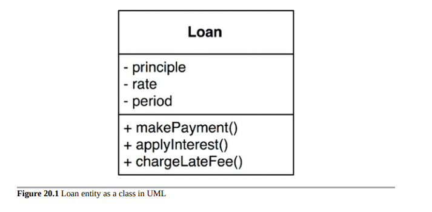
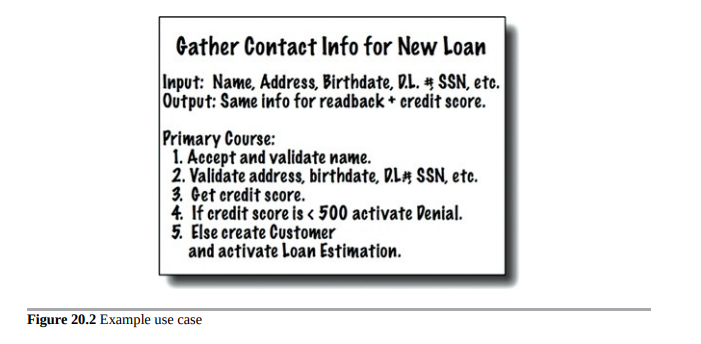

# 业务规则

如果我们要将我们的应用程序分成业务规则和插件，我们最好对业务规则有一个清晰的了解。事实证明，业务规则有几种不同类型。

严格来说，业务规则是能够为企业创造或节省资金的规则或程序。更严格地说，这些规则可以使企业赚钱或省钱，无论它们是否在计算机上实现，即使它们是手动执行的，它们也可以创造或节省资金。

银行对贷款收取N％的利息是一个可以为银行赚钱的业务规则。无论是计算机程序计算利息还是文员用算盘计算利息都无关紧要。

我们将这些规则称为关键业务规则，因为它们对企业本身至关重要，即使没有自动化系统，它们也会存在。

关键业务规则通常需要一些数据才能运作。例如，我们的贷款需要贷款余额、利率和付款计划。

我们将这些数据称为关键业务数据。即使系统未自动化，这些数据也将存在。

关键规则和关键数据密不可分，因此它们是一个良好的对象候选者。我们将这种对象称为实体。

## 实体

实体是我们计算机系统内的一个对象，它体现了一组关键业务规则对关键业务数据的操作。实体对象要么包含关键业务数据，要么可以非常容易地访问该数据。实体的接口由实现操作该数据的关键业务规则的函数组成。

例如，图20.1展示了我们的Loan实体作为UML类的样子。它有三个关键业务数据，并在其接口中提供了三个相关的关键业务规则。

当我们创建这种类型的类时，我们将实现与业务相关的软件集合在一起，并将其与我们正在构建的自动化系统中的每个其他关注点分离开来。这个类独立地代表着业务。它没有与数据库、用户界面或第三方框架相关的问题。它可以在任何系统中为业务服务，无论该系统如何呈现，数据如何存储，或该系统中的计算机如何排列。实体是纯粹的业务，什么都不是。

您中的一些人可能担心我称它为类。不用担心。您不需要使用面向对象的语言来创建实体。所需的仅是将关键业务数据和关键业务规则绑定在单独的软件模块中。

## 用例

并非所有的业务规则都像实体那样纯粹。有些业务规则通过定义和限制自动化系统的运行方式来为企业赚钱或节省开支。这些规则在手动环境下不会使用，因为它们只有在自动化系统的一部分时才有意义。

例如，想象一个应用程序，由银行职员用来创建新贷款。银行可能决定，除非贷款职员首先收集并验证了联系信息并确保候选人的信用评分达到500分或更高，否则不希望他们提供贷款支付估算。因此，银行可能规定，除非联系信息屏幕填写并验证完毕，且信用评分已被确认为高于截止点，否则系统不会进入支付估算屏幕。

这是一个用例。

一个用例是对自动化系统使用方式的描述。它指定了由用户提供的输入、返回给用户的输出以及生成该输出所涉及的处理步骤。一个用例描述了特定于应用程序的业务规则，而不是实体内的关键业务规则。

图20.2展示了一个用例的示例。请注意，在最后一行中提到了客户。这是对客户实体的引用，该实体包含管理银行和其客户之间关系的关键业务规则。

用例包含指定何时以及如何调用实体内关键业务规则的规则。用例控制实体之间的交互。还要注意，除了非正式地指定从该接口传入的数据和通过该接口传出的数据之外，用例不描述用户界面。从用例中无法确定应用程序是通过Web、厚客户端、控制台还是作为纯服务提供的。

这非常重要。用例不描述系统对用户的外观。相反，它们描述了规定用户和实体之间交互的应用程序特定规则。数据如何进出系统对用例来说无关紧要。

用例是一个对象。它有一个或多个实现应用程序特定业务规则的函数。它还有数据元素，包括输入数据、输出数据以及与之交互的适当实体的引用。

实体不知道控制它们的用例。这是遵循依赖倒置原则的另一个例子。高级概念（例如实体）不知道低级概念（例如用例）。相反，低级用例知道高级实体。

为什么实体是高层次的，用例是低层次的呢？因为用例是特定于单个应用程序的，因此它们更接近该系统的输入和输出。实体是可以用于许多不同应用程序的概括，因此它们距离系统的输入和输出更远。用例依赖于实体；实体不依赖于用例。

## 请求和响应模型

用例需要输入数据，并生成输出数据。但是，一个良好的用例对象不应该知道数据以何种方式与用户或任何其他组件通信。我们当然不希望用例类中的代码了解HTML或SQL！

用例类接受简单的请求数据结构作为其输入，并将简单的响应数据结构作为其输出返回。这些数据结构不依赖于任何东西。它们不派生自标准框架接口，如HttpRequest和HttpResponse。它们对Web一无所知，也不与任何用户界面共享任何附属物。
这种缺乏依赖性是关键的。如果请求和响应模型不独立，那么依赖它们的用例将间接地绑定到模型携带的任何依赖项。

您可能会想让这些数据结构包含对实体对象的引用。您可能认为这很有意义，因为实体和请求/响应模型共享许多数据。避免这种诱惑！这两个对象的目的非常不同。随着时间的推移，它们将因为非常不同的原因而发生变化，因此以任何方式将它们绑定在一起都违反了公共闭包原则和单一责任原则。结果将是大量的杂物数据和代码中的大量条件。

## 结论

业务规则是软件系统存在的原因。它们是核心功能。它们携带着能够创造或节约金钱的代码。它们是家族的珠宝。

业务规则应该保持原始，不受用户界面或数据库等更低级别问题的影响。理想情况下，代表业务规则的代码应该是系统的核心，其他次要问题应该插入其中。业务规则应该是系统中最独立和可重用的代码。