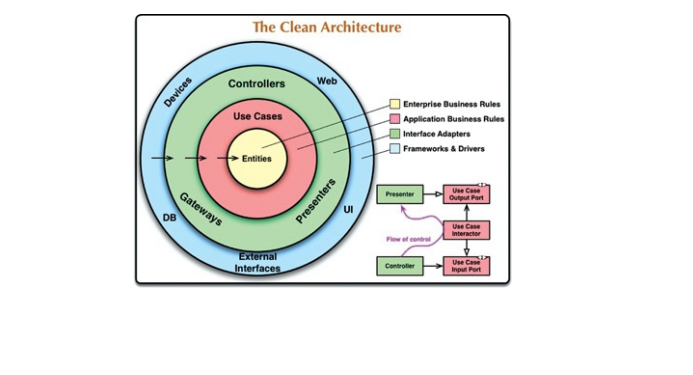
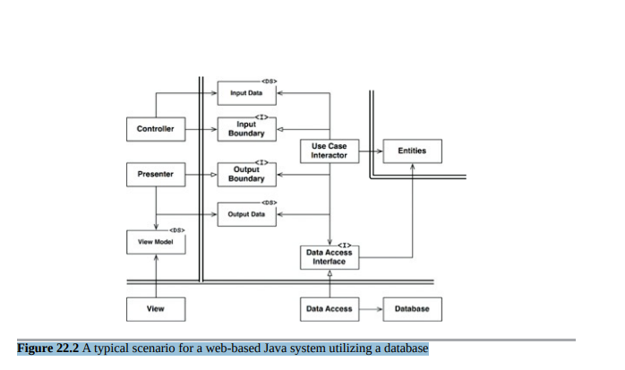

# 清晰架构

在过去的几十年里，我们见证了系统架构的一系列想法，包括：

+ 六边形架构（也称为端口和适配器），由Alistair Cockburn开发，并在Steve Freeman和Nat Pryce的著作《Growing Object Oriented Software with Tests》中得到采用。
+ James Coplien和Trygve Reenskaug的DCI
+ Ivar Jacobson从他的书《面向用例的对象式软件工程》中介绍的BCE

尽管这些架构在细节上略有不同，但它们非常相似。它们都有相同的目标，即关注点分离。它们通过将软件分成层来实现这种分离。每个架构至少有一个业务规则层，以及一个用户和系统界面层。
每种架构都产生具有以下特征的系统：

+ 独立于框架。架构不依赖于某些功能丰富的软件库的存在。这使您可以将这些框架用作工具，而不是强制将系统塞入其受限制的约束中。
+ 可测试。业务规则可以在没有UI、数据库、Web服务器或任何其他外部元素的情况下进行测试。
+ 独立于UI。UI可以轻松更改，而不会更改系统的其余部分。例如，Web UI可以被控制台UI替换，而不会更改业务规则。
+ 独立于数据库。您可以将Oracle或SQL Server替换为Mongo、BigTable、CouchDB或其他内容。您的业务规则不受数据库约束。
+ 独立于任何外部机构。实际上，您的业务规则根本不知道与外部世界的接口有关的任何信息。

图22.1中的图表尝试将所有这些架构整合为一个可操作的想法。

## 依赖规则

图22.1中的同心圆代表软件的不同区域。一般来说，越靠内，软件就越高级。外圈是机制，内圈是策略。

使这种架构工作的最重要规则是依赖规则：

> [!NOTE]
> 源代码依赖关系必须只指向向内的更高级别策略。

内圈中的任何内容都不能知道外圈中的任何内容。特别是，内圈代码中不得提及在外圈中声明的任何名称。这包括函数、类、变量或任何其他命名的软件实体。

同样，不应该在内圈中使用在外圈声明的数据格式，尤其是如果这些格式是由外圈中的框架生成的。我们不希望外圈中的任何内容影响内圈。

## 实体

实体封装了企业级的关键业务规则。实体可以是带有方法的对象，也可以是一组数据结构和函数。只要这些实体能够被企业中许多不同的应用程序使用即可。如果你没有企业，只是编写单个应用程序，那么这些实体就是应用程序的业务对象。它们封装了最通用和高级别的规则。当外部发生变化时，它们最不可能改变。例如，你不希望这些对象受到页面导航或安全性变更的影响。任何特定应用程序的运行变化都不应该影响实体层。

## 用例

用例层的软件包含特定于应用程序的业务规则。它封装和实现系统的所有用例。这些用例协调从实体中流入和流出的数据，并指导这些实体使用它们的关键业务规则以实现用例的目标。我们不希望更改此层会影响实体。我们也不希望此层受到数据库、UI或任何常见框架等外部因素的影响。用例层与这些问题是隔离的。但是，我们期望应用程序操作的更改将影响用例层，因此也会影响此层的软件。如果用例的细节发生变化，则该层中的一些代码肯定会受到影响。

## 接口适配器

接口适配器层的软件是一组适配器，将数据从对用例和实体最方便的格式转换为对某些外部机构最方便的格式，例如数据库或网络。例如，这一层将完全包含 GUI 的 MVC 架构。演示者、视图和控制器都属于接口适配器层。模型可能只是从控制器传递给用例，然后再从用例传递回演示者和视图的数据结构。

同样，在这一层中，数据会从最方便的实体和用例形式转换为最方便的持久性框架使用的形式（即数据库）。这个圆圈内的任何代码都不应该知道数据库的任何情况。如果数据库是 SQL 数据库，则所有 SQL 应该限制在这一层，特别是与数据库有关的部分。

此外，还有任何其他适配器，必要时可以将数据从某些外部形式（例如外部服务）转换为用例和实体使用的内部形式。

## 框架和驱动程序

图22.1中模型的最外层通常由诸如数据库和 Web 框架之类的框架和工具组成。通常，你不会在这一层中编写太多代码，除了与下一个圆圈通信的胶水代码。

框架和驱动程序层是所有细节的归宿。Web 是一个细节。数据库是一个细节。我们将这些事情放在外面，这样它们就不会造成太大的伤害。

## 仅有四个圆圈吗？

图22.1中的圆圈是作为示意图而存在的：您可能会发现您需要更多的圆圈。并没有规定说您必须只有这四个。但是，依赖规则始终适用。源代码依赖性总是指向内部。随着向内移动，抽象级别和策略水平会增加。最外层圆圈由低级别具体细节组成。向内移动，软件变得更加抽象，并封装了更高级别的策略。最内层圆圈是最普遍和最高级别的。

## 越过边界

在图22.1中，图的右下方显示了我们如何跨越圆圈边界的示例。它展示了控制器和展示器与下一层的用例进行通信。请注意控制流：它从控制器开始，通过用例，然后在展示器中执行结束。还请注意源代码依赖性：每个依赖性都指向内部，指向用例。

我们通常通过使用依赖反转原则来解决这种表面上的矛盾。例如，在Java这样的语言中，我们会安排接口和继承关系，使得源代码依赖关系在跨越边界的正确点上与控制流相反。

例如，假设用例需要调用展示器。这个调用不能直接进行，因为这会违反依赖规则：内部圆圈中的名称不能被外部圆圈提及。因此，我们让用例在内部圆圈中调用接口（在图22.1中显示为“用例输出端口”），并让外部圆圈中的展示器实现它。

相同的技术用于穿越体系结构中的所有边界。我们利用动态多态性创建源代码依赖性，以反对控制流，以便无论控制流走向何方，都可以符合依赖规则。

## 哪些数据会跨越边界

通常，跨越边界的数据由简单的数据结构组成。您可以使用基本的结构体或简单的数据传输对象，或者数据可以仅仅是函数调用的参数。或者您可以将数据打包成哈希映射，或者构建成一个对象。重要的是，只有孤立的简单数据结构会跨越边界。我们不想作弊并传递实体对象或数据库行。我们不希望数据结构具有任何违反依赖规则的依赖关系。

例如，许多数据库框架以一种便捷的数据格式响应查询。我们可能称之为“行结构”。我们不希望跨越边界向内传递该行结构。这样做会违反依赖规则，因为它会强制内部圆圈了解外部圆圈的一些内容。

因此，当我们跨越边界传递数据时，它总是采用对内部圈最方便的形式。

## 一个典型的场景

图22.2展示了一个使用数据库的基于web的Java系统的典型场景。Web服务器收集用户输入的数据并将其传递给左上方的控制器(Controller)。控制器将这些数据封装成一个普通的Java对象，并通过InputBoundary接口将此对象传递给UseCaseInteractor。UseCaseInteractor解释该数据并使用它来控制实体(Entities)的操作。它还使用DataAccessInterface从数据库中将这些实体使用的数据加载到内存中。完成后，UseCaseInteractor从实体中收集数据，并将其构建为OutputData，另一个普通的Java对象。然后，OutputData通过OutputBoundary接口传递给Presenter。

Presenter的工作是将OutputData重新封装为可视化形式的ViewModel，它是另一个普通的Java对象。ViewModel主要包含View用于显示数据的字符串和标志。虽然OutputData可能包含日期对象，但Presenter将使用已正确格式化的相应字符串来加载ViewModel。对于货币对象或任何其他与业务相关的数据也是如此。按钮和菜单项的名称以及指示View这些按钮和菜单项是否应为灰色的标志都放在ViewModel中。

这使得View几乎没有什么可做的，除了将数据从ViewModel移动到HTML页面中。

请注意依赖项的方向。所有依赖关系都跨越边界线向内指，遵循依赖性规则。

## 结论

遵循这些简单的规则并不难，而且它将为您节省大量的后顾之忧。通过将软件分成层并遵守依赖规则，您将创建一个本质上可测试的系统，并获得所有相关好处。当系统的任何外部部分变得过时，例如数据库或Web框架，您可以轻松地将这些过时的元素替换掉。

