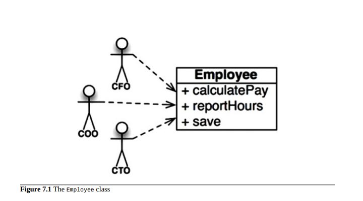
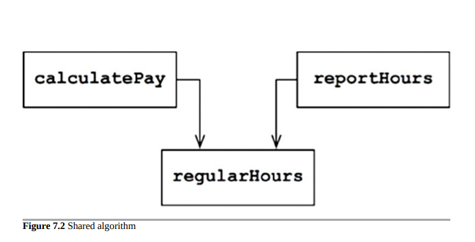
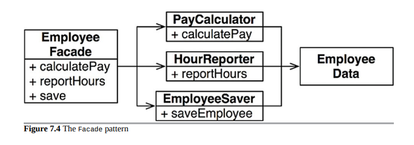

- [SRP 单一职责原则 (Single Responsibility Principle)](#srp-单一职责原则-single-responsibility-principle)
  - [症状 1：意外重复](#症状-1意外重复)
  - [症状 2：合并](#症状-2合并)
  - [解决方案](#解决方案)
  - [结论](#结论)

# SRP 单一职责原则 (Single Responsibility Principle)

在所有的 SOLID 原则中，单一职责原则（SRP）可能是最难理解的一个。这很可能是因为它有一个特别不合适的名字。程序员很容易听到这个名字，然后假设它意味着每个模块应该只做一件事情。

毫不怀疑，确实有这样一个原则。一个函数应该只做一件事情。我们在将大型函数重构为小型函数时使用这个原则；我们在最低层次上使用它。但它不是 SOLID 原则之一 - 它不是 SRP。

从历史上看，SRP 被描述为：

> 一个模块应该有一个，且仅有一个，改变的原因。

不幸的是，“用户”和“利益相关者”这些词并不是在这里使用的正确词语。可能会有多个用户或利益相关者希望以相同的方式更改系统。相反，我们实际上是指一个群体 - 需要进行这种更改的一个或多个人。我们将称这个群体为“actor”。

因此，SRP 的最终版本是：

> 一个模块应该只对一个 actor 负责。

那么，“模块”这个词是什么意思呢？最简单的定义就是一个源文件。大多数情况下这个定义是可以接受的。然而，有些语言和开发环境并不使用源文件来存储代码。在这种情况下，模块就是一个内聚的函数和数据结构集合。这个词“内聚”意味着 SRP。内聚是将代码与单个演员负责的力量结合在一起的力量。
也许理解这个原则最好的方法是看一下违反它的症状。

## 症状 1：意外重复

我最爱的例子是一个支付应用程序中的 Employee 类。它有三个方法：calculatePay（），reportHours()和 save()（图 7.1）。

这个类违反了 SRP，因为这三种方法对三个非常不同的 actor 负责。

- calculatePay()方法由会计部门指定，向 CFO 报告。
- reportHours()方法由人力资源部门指定和使用，向 COO 报告。
- save()方法由数据库管理员（DBA）指定，向 CTO 报告。

将这三种方法的源代码放入单个 Employee 类中，开发人员将每个 actor 与其他 actor 耦合起来。这种耦合可能导致 CFO 团队的操作影响 COO 团队所依赖的东西。

例如，假设 calculatePay()函数和 reportHours()函数共享计算非加班工时的通用算法。假设开发人员小心地不重复代码，并将该算法放入名为 regularHours()的函数中（图 7.2）。

现在假设 CFO 团队决定需要调整计算非加班工时的方式。相比之下，人力资源部门中的 COO 团队不希望进行特定的调整，因为他们将非加班工时用于不同的目的。

委派一个开发人员来进行更改，并查看由 calculatePay()方法调用的方便的 regularHours()函数。不幸的是，该开发人员没有注意到该函数也被 reportHours（）函数调用。

开发人员进行所需的更改并仔细测试。 CFO 团队验证新函数按预期工作，系统得到部署。
当然，COO 团队不知道发生了什么。 HR 人员继续使用 reportHours()函数生成的报告，但现在包含不正确的数字。最终问题被发现，COO 非常愤怒，因为错误的数据为他的预算造成了数百万美元的损失。

我们都看过类似的事情发生。这些问题发生是因为我们将不同 actor 依赖的代码放在了很近的地方。SRP 建议将不同 actor 依赖的代码分开。

## 症状 2：合并

可以想象，在包含许多不同方法的源文件中，合并将是常见情况。如果这些方法是为不同的角色负责，情况尤其可能如此。

例如，假设首席技术官的数据库管理员团队决定对数据库的员工表进行简单的架构更改。再假设首席运营官的人力资源职员团队决定他们需要更改小时报告的格式。

可能来自两个不同团队的两个不同的开发人员检出员工类并开始进行更改。不幸的是，他们的更改冲突了。结果就是合并。

我可能不需要告诉您合并是有风险的。我们现在的工具非常好用，但没有工具能够处理每个合并案例。最终，总会存在风险。

在我们的例子中，合并使首席技术官和首席运营官都面临风险。首席财务官也可能会受到影响，这并非不可想象。

还有许多其他症状，我们可以调查，但它们都涉及多个人出于不同原因更改同一源文件的情况。

再次强调，避免这个问题的方法是分离支持不同 actor 的代码。

## 解决方案

有许多不同的解决方案来解决这个问题。每种方案将函数移入不同的类中。

解决问题的最明显的方法可能是将数据与函数分离。三个类共享对 EmployeeData 的访问，它是一个没有方法的简单数据结构（图 7.3）。每个类仅持有其特定函数所需的源代码。这三个类不允许彼此了解，因此避免了任何意外的重复。

图 7.3 三个类不知道彼此的存在

这种解决方案的缺点是开发人员现在必须实例化和跟踪三个类。解决这个困境的常见方法是使用 Facade 模式（图 7.4）。

图 7.4 Facade 模式

EmployeeFacade 包含非常少的代码。它负责实例化和委托具有函数的类。
一些开发人员更喜欢将最重要的业务规则保持靠近数据。这可以通过将最重要的方法保留在原始 Employee 类中，然后使用该类作为较小函数的 Facade 来完成（图 7.5）。

图 7.5 最重要的方法保留在原始 Employee 类中，作为较小函数的 Facade 使用
您可能会反对这些解决方案，因为每个类将只包含一个函数。这并不完全正确。计算工资、生成报告或保存数据所需的函数数量在每种情况下都很大。每个类都将包含许多私有方法。

每个包含这样一组方法的类都是一个作用域。在该作用域之外，没有人知道这个家族的私有成员的存在。

## 结论

单一职责原则是关于函数和类的，但它在两个更高层次上以不同的形式再次出现。在组件层面上，它变成了公共封闭原则。在架构层面上，它成为变化轴，负责创建架构边界。在接下来的章节中，我们将学习所有这些思想。
