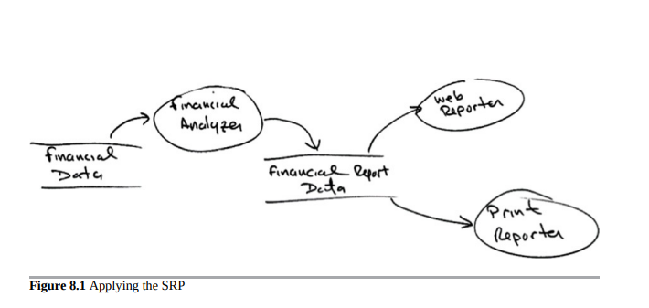
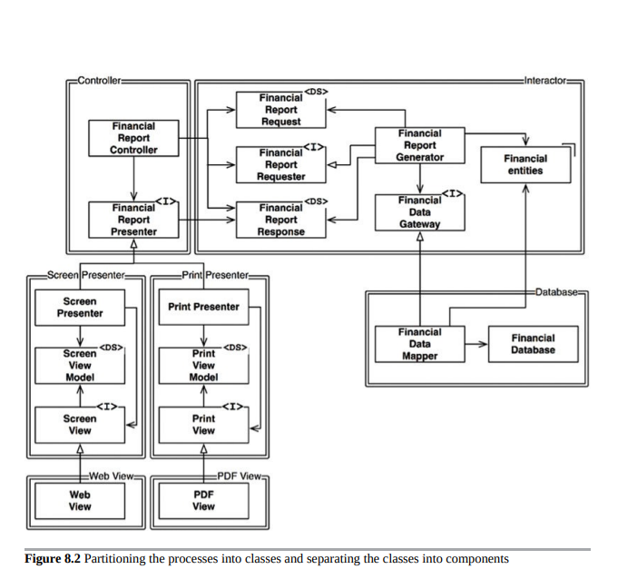
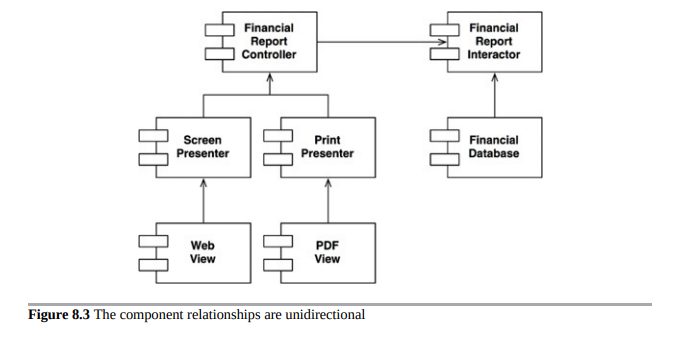

- [OCP 开-闭原则 (Open-Closed Principle)](#ocp-开-闭原则-open-closed-principle)
  - [一个思维实验](#一个思维实验)
  - [方向控制](#方向控制)
  - [信息隐藏](#信息隐藏)
  - [结论](#结论)

# OCP 开-闭原则 (Open-Closed Principle)

开闭原则（OCP）是由Bertrand Meyer于1988年提出的。它的意思是：

> 软件构件应该对扩展开放，但对修改关闭。

换句话说，软件构件的行为应该是可扩展的，而不必修改该构件。当然，这是我们研究软件架构的最根本原因。显然，如果对需求的简单扩展强制软件进行大规模修改，那么该软件系统的架构师就已经犯了一个惊人的错误。

大多数软件设计学习者都将OCP视为指导他们设计类和模块的原则。但是，当我们考虑到架构组件的层面时，这个原则就更具有重要意义了。

一个思维实验可以使这一点清晰明了。

## 一个思维实验

想象一下，我们有一个在网页上显示财务摘要的系统。页面上的数据可以滚动，并且负数会用红色显示。

现在想象一下，利益相关者要求将同样的信息转化为一份要打印在黑白打印机上的报告。报告应该被适当地分页，有适当的页眉、页脚和列标签。负数应该用括号括起来。

显然，必须编写一些新代码。但是，多少旧代码需要更改呢？

良好的软件架构将减少更改代码的数量到最少的程度。理想情况下，是零。

如何做到这一点？通过正确分离由不同原因引起的变化（单一责任原则），然后正确组织这些变化之间的依赖关系（依赖反转原则）。

通过应用SRP，我们可以得到图8.1所示的数据流视图。一些分析过程检查财务数据并产生可报告数据，然后由两个报告过程适当地格式化。

这里的关键洞见是，生成报告涉及两个独立的职责：报告数据的计算和将数据呈现为适合网页和打印机的形式。

在进行这种分离后，我们需要组织源代码依赖关系，以确保对其中一种职责的更改不会导致另一种职责的更改。此外，新组织应该确保行为可以扩展而不需要进行修改。

我们通过将进程分区成类，并将这些类分成组件来实现这一点，如图8.2中的图表中的双线所示。在这个图中，左上角的组件是控制器。在右上方，我们有交互器。在右下方，有数据库。最后，在左下方，有四个组件代表了Presenter和View。

带有<I>标记的类是接口；带有<DS>标记的类是数据结构。开放式箭头表示使用关系。实线箭头表示实现或继承关系。

第一件要注意的是，所有的依赖都是源代码依赖关系。从类A指向类B的箭头意味着类A的源代码提到了类B的名称，但类B对类A一无所知。因此，在图8.2中，FinancialDataMapper通过实现关系了解了FinancialDataGateway，但FinancialGateway对FinancialDataMapper一无所知。

接下来要注意的是，每个双线只有一个方向被穿过。这意味着所有组件关系都是单向的，如图8.3所示。这些箭头指向我们想要保护免受更改的组件。

图8.3 组件关系是单向的。

让我再说一遍：如果要保护组件A免受组件B的更改影响，则组件B应该依赖于组件A。

我们希望保护Controller免受Presenters更改的影响。我们希望保护Presenters免受Views更改的影响。我们希望保护Interactor免受任何更改的影响。

Interactor处于最符合OCP的位置。对数据库、Controller、Presenters或Views的更改对Interactor没有影响。

为什么Interactor具有如此特殊的地位？因为它包含业务规则。Interactor包含应用程序的最高级策略。所有其他组件都处理外围问题。Interactor处理中心问题。

尽管Controller对于Interactor来说是外围问题，但它对于Presenters和Views来说仍然是核心问题。虽然Presenters对于Controller来说可能是外围问题，但对于Views来说却是核心问题。

注意，这样创建了一个基于“级别”概念的保护层次结构。Interactors是最高级别的概念，因此它们受到最大的保护。Views是最低级别的概念之一，因此它们受到最小的保护。Presenters比Views高级，但比Controller或Interactor低级。

这就是OCP在架构层面上的工作方式。架构师根据功能如何、为什么以及何时发生变化来分离功能，然后将分离的功能组织成组件层次结构。在该层次结构中较高级别的组件受到对较低级别组件所做更改的保护。

Interactor处于符合开闭原则（OCP）的最佳位置。对于数据库、控制器、展示器或视图的更改不会影响Interactor。

为什么Interactor会拥有这样特权的位置？因为它包含业务规则。Interactor包含应用程序的最高级别策略。所有其他组件都在处理外围问题。Interactor处理的是核心问题。

尽管控制器对于Interactor来说是外围的，但对于展示器和视图来说仍然是核心的。虽然展示器可能对于控制器来说是外围的，但它们对于视图来说是核心的。

请注意，这样创建了一个基于“级别”概念的保护层次结构。Interactors是最高级别的概念，因此它们是最受保护的。视图是最低级别的概念之一，因此它们是最不受保护的。展示器比视图的级别高，但比控制器或Interactor的级别低。

这就是OCP在架构层面上的工作方式。架构师基于功能的变化方式、原因和时间进行分离，然后将这些分离的功能组织成一个组件层次结构。在该层次结构中，较高级别的组件受到对较低级别组件所做更改的保护。

## 方向控制

如果你对之前展示的类设计感到恐惧，请再看一遍。那张图中很多的复杂性是为了确保组件之间的依赖指向正确的方向。例如，FinancialDataGateway 接口连接了 FinancialReportGenerator 和 FinancialDataMapper，以颠倒从 Interactor 组件指向 Database 组件的依赖关系。FinancialReportPresenter 接口和两个 View 接口也是同样的道理。

## 信息隐藏

FinancialReportRequester接口具有不同的用途。它的存在是为了保护FinancialReportController不过度了解Interactor的内部。如果没有该接口，则控制器会对FinancialEntities产生传递依赖。

传递依赖是违反软件实体不应依赖它们不直接使用的一般原则的。当我们谈论接口隔离原则和共同重用原则时，我们将再次遇到这个原则。

因此，即使我们的第一优先级是保护Interactor免受对Controller的更改，我们也希望通过隐藏Interactor的内部来保护Controller免受Interactor的更改影响。

## 结论

OCP是系统架构的推动力之一。其目标是使系统易于扩展，而不会产生高的变更影响。通过将系统划分为组件，并将这些组件排列成依赖层次结构，从而保护较高级别的组件免受较低级别组件的更改的影响。
