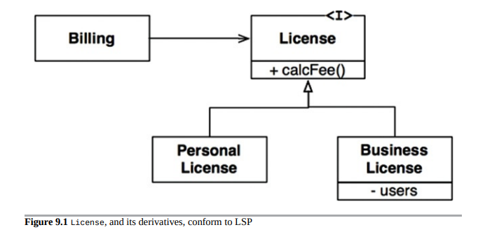
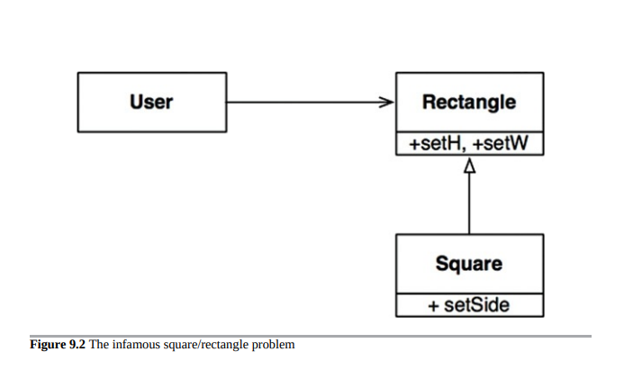

# LSP 里式替换原则 (Liskov Substitution Principle)

1988年，Barbara Liskov写了以下内容作为定义子类型的一种方式。

> 如果对于类型为S的每个对象o1，存在类型为T的对象o2，使得对于所有基于T定义的程序P，在将o1替换为o2时，P的行为保持不变，则S是T的一个子类型。

为了理解这个想法，也就是里式替换原则(Liskov Substitution Principle，简称LSP)，我们来看一些例子。

##　指导继承使用方法

假设我们有一个名为License的类，如图9.1所示。该类有一个名为calcFee()的方法，由Billing应用程序调用。License有两个“子类型”：PersonalLicense和BusinessLicense。它们使用不同的算法来计算许可费用。

图9.1中的License及其派生类符合LSP原则。



这种设计符合LSP原则，因为Billing应用程序的行为不依赖于它使用的两个子类型中的任何一个。这两个子类型都可以替换License类型。

##　正方形/矩形问题

LSP原则违反的经典例子是著名的（或臭名昭著的，这取决于你的观点）正方形/矩形问题（图9.2）。



在这个例子中，正方形并不是矩形的真正子类型，因为矩形的高度和宽度是独立可变的；相比之下，正方形的高度和宽度必须同时更改。由于用户认为它正在与一个矩形进行通信，因此它很容易感到困惑。以下代码说明了为什么会出现这种情况：

```
Rectangle r = …
r.setW(5);
r.setH(2);
assert(r.area() == 10);
```

如果...代码生成了一个正方形，则断言将失败。

防止这种LSP违反的唯一方法是为用户添加机制（例如if语句），以检测矩形是否实际上是正方形。由于用户的行为取决于它使用的类型，因此这些类型是不能相互替换的。

## LSP和架构

在面向对象革命的早期，我们认为LSP是引导继承使用的一种方式，就像前面的章节所示。然而，多年来，LSP已经演变成了一种更广泛的软件设计原则，涉及接口和实现。

所涉及的接口可以有许多形式。我们可能有一个由几个类实现的Java风格的接口。或者我们可能有几个Ruby类共享相同的方法签名。或者我们可能有一组所有响应相同REST接口的服务。

在所有这些情况下，以及更多情况下，LSP都是适用的，因为有用户依赖于定义良好的接口以及这些接口的实现的可替换性。

从架构的角度来理解LSP的最好方法是看一下当违反原则时系统的架构会发生什么。

## 违反LSP的示例

假设我们正在构建一个用于许多出租车调度服务的聚合器。客户使用我们的网站找到最合适的出租车。一旦客户做出决定，我们的系统使用restful服务调度所选择的出租车。

现在假设restful调度服务的URI是包含在司机数据库中的信息的一部分。一旦我们的系统选择了适合客户的司机，它从司机记录中获取该URI，然后使用它来调度司机。

假设司机Bob有一个看起来像这样的调度URI：

```
purplecab.com/driver/Bob
```

我们的系统将在此URI上附加调度信息，并使用PUT发送它，如下所示：

```
/pickupAddress/24 Maple St.
/pickupTime/153
/destination/OR
```

显然，这意味着所有不同公司的派遣服务必须符合相同的REST接口。它们必须将pickupAddress、pickupTime和destination字段视为相同。现在假设Acme出租车公司雇用了一些没有仔细阅读规格的程序员。他们将目的地字段简写为dest。Acme是我们地区最大的出租车公司，Acme的首席执行官的前妻是我们首席执行官的新妻子，等等……你可以想象一下，这对我们的系统架构会有什么影响。

显然，我们需要添加一个特殊情况。任何Acme司机的调度请求都必须使用与所有其他司机不同的规则进行构建。

实现这个目标的最简单方法是向构建调度命令的模块添加一个if语句：

```
if (driver.getDispatchUri().startsWith("acme.com"))…
```

但是，当然，没有一个合格的架构师会允许这样的结构存在于系统中。在代码中加入“acme”这个词本身就为各种可怕而神秘的错误创造了机会，更不用说安全漏洞了

例如，如果Acme变得更加成功并购买Purple出租车公司会怎么样？如果合并后的公司维护分开的品牌和分开的网站，但统一了所有原公司的系统呢？我们需要再为“purple”添加另一个if语句吗？

我们的架构师必须通过创建一些由调度URI键控的配置数据库驱动的调度命令创建模块来使系统免受此类错误的影响。配置数据可能如下所示：

URI调度格式
```
Acme.com/pickupAddress/%s/pickupTime/%s/dest/%s
. /pickupAddress/%s/pickupTime/%s/destination/%s
```
因此，我们的架构师不得不添加一个重要而复杂的机制来处理Restful服务接口并不全部可替换的事实。

## 结论

LSP原则可以并且应该被扩展到体系结构的层面。对可替换性的简单违反可能导致系统体系结构中添加大量的额外机制。